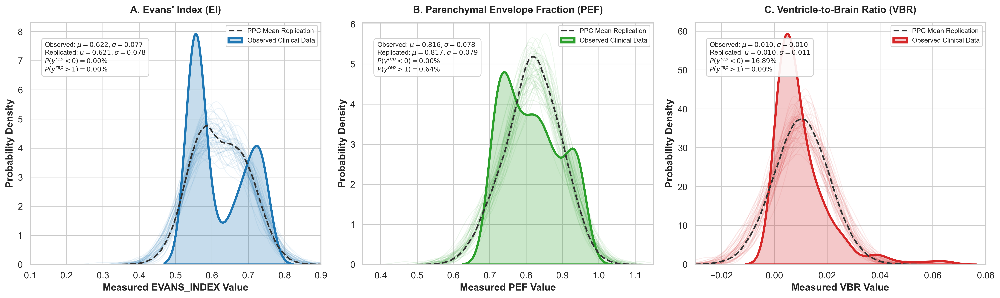

# What Survives the Blur? Macro-Brain Morphometry and Uncertainty Quantification from Heterogeneous Routine Clinical MRI in Nigeria

[](https://bids.neuroimaging.io/)
[](https://www.pymc.io/)
[](https://www.python.org/)
[](https://creativecommons.org/licenses/by/4.0/)
[](https://www.go-fair.org/fair-principles/)
[](#)

**Principal Investigator & Lead Author:** Patrick Filima  
**Affiliation:** African Brain Data Network (ABDN) & Collaborating Nigerian Clinical Centers  
**Clinical Partner Institutions:** Rivers State University Teaching Hospital (RSUTH), University of Port Harcourt Teaching Hospital (UPTH), Aminu Kano Teaching Hospital (AKTH) / Northwest Kano Diagnostic Centre (NKDC), Braithwaite Memorial Hospital (BMH), Intercontinental Diagnostic Centre (IDC), Life Bridge Diagnostic Centre  
**Foundational Data Provenance:** _Scientific Data_ (2025) [DOI: 10.1038/s41597-025-04743-0](https://doi.org/10.1038/s41597-025-04743-0) | [brainlife.io project](https://doi.org/10.25663/brainlife.p6554f423b094062da63aa4c9)

---

## 📑 Table of Contents

- [1. Executive Summary: The Scientific Pivot](#1-executive-summary-the-scientific-pivot)
  - [1.1 The Global Neuroimaging Equity Gap](#11-the-global-neuroimaging-equity-gap)
  - [1.2 The "1 mm³ Isotropic MPRAGE" Fallacy](#12-the-1-mm-isotropic-mprage-fallacy)
  - [1.3 The Practical Reality of Routine Clinical MRI in Nigeria](#13-the-practical-reality-of-routine-clinical-mri-in-nigeria)
  - [1.4 The Attrition Trap of Standard Pipelines](#14-the-attrition-trap-of-standard-pipelines)
  - [1.5 The Core Scientific Contribution: "What Survives the Blur?"](#15-the-core-scientific-contribution-what-survives-the-blur)
- [2. Research Aims & Questions](#2-research-aims--questions)
  - [2.1 Primary Research Question](#21-primary-research-question)
  - [2.2 Specific Aims](#22-specific-aims)
  - [2.3 The A Priori Detectability Gradient](#23-the-a-priori-detectability-gradient)
- [3. Multi-Center Clinical Dataset Architecture](#3-multi-center-clinical-dataset-architecture)
  - [3.1 Cohort Composition & Provenance ($N = 218$)](#31-cohort-composition--provenance-n--218)
  - [3.2 Participating Clinical Centers & Hardware Profiles](#32-participating-clinical-centers--hardware-profiles)
  - [3.3 Acquisition Heterogeneity & Identifiability Matrix](#33-acquisition-heterogeneity--identifiability-matrix)
- [4. Three-Tier Experimental Architecture](#4-three-tier-experimental-architecture)
  - [4.1 Experiment 1: Controlled Synthetic Degradation Lab](#41-experiment-1-controlled-synthetic-degradation-lab)
  - [4.2 Experiment 2: Real-World Clinical Measurement Validity & Failure Boundaries](#42-experiment-2-real-world-clinical-measurement-validity--failure-boundaries)
  - [4.3 Experiment 3: Uncertainty-Aware Disease Inference & Confounding Sensitivity](#43-experiment-3-uncertainty-aware-disease-inference--confounding-sensitivity)
- [5. Mathematical & Statistical Framework](#5-mathematical--statistical-framework)
  - [5.1 Heteroskedastic Observation Likelihood](#51-heteroskedastic-observation-likelihood)
  - [5.2 Hierarchical Prior Structure](#52-hierarchical-prior-structure)
  - [5.3 Posterior Variance Partitioning (ICC)](#53-posterior-variance-partitioning-icc)
  - [5.4 Model Comparison Hierarchy](#54-model-comparison-hierarchy)
- [6. Repository Architecture & Artifact Directory](#6-repository-architecture--artifact-directory)
- [7. Step-by-Step Execution Guide](#7-step-by-step-execution-guide)
  - [7.1 Prerequisites & Virtual Environment](#71-prerequisites--virtual-environment)
  - [7.2 BIDS Validation](#72-bids-validation)
  - [7.3 Macro-Morphometric Feature Extraction](#73-macro-morphometric-feature-extraction)
  - [7.4 Running Hierarchical Bayesian Inference](#74-running-hierarchical-bayesian-inference)
  - [7.5 Generating Publication Figures & Diagnostic Forest Plots](#75-generating-publication-figures--diagnostic-forest-plots)
- [8. Empirical Findings from the Nigerian Cohort](#8-empirical-findings-from-the-nigerian-cohort)
- [9. Ethical Compliance & FAIR Data Stewardship](#9-ethical-compliance--fair-data-stewardship)
- [10. Citation & Acknowledgments](#10-citation--acknowledgments)

---

## 1. Executive Summary: The Scientific Pivot

### 1.1 The Global Neuroimaging Equity Gap

Sub-Saharan Africa accounts for approximately 18% of the global human population, yet less than **2% of published magnetic resonance imaging (MRI) studies** include cohorts of African descent. Global neuroimaging consortia (ADNI, UK Biobank, HCP) have developed normative atlases and analytical pipelines almost exclusively calibrated on high-income, Western cohorts scanned under rigid, research-grade protocols.

### 1.2 The "1 mm³ Isotropic MPRAGE" Fallacy

Standard neuroimaging software tools—including FreeSurfer (`recon-all`), FSL FAST (tissue segmentation), FSL FIRST (subcortical structure segmentation), and SPM—were engineered on an implicit assumption: **high-contrast, 3D volumetric, 1.0 mm³ isotropic T1-weighted MPRAGE/SPGR acquisitions scanned at 3.0 Tesla**.

In prospective clinical trials or Western academic imaging centers, scans that do not conform to these specifications are discarded. However, applying this exclusionary criterion in low- and middle-income countries (LMICs) renders **over 90% of all acquired clinical neuroimaging data unusable**.

### 1.3 The Practical Reality of Routine Clinical MRI in Nigeria

This project is grounded in retrospective, routine clinical neuroimaging workflows across hospital sites and diagnostic centers in Nigeria (Port Harcourt, Kano, and Abuja). An empirical audit of the hospital archives reveals:

1. **2D Thick-Slice Acquisitions:** 83.9% ($183/218$) of all clinical T1-weighted scans are 2D Fast Spin Echo (FSE) or Spin Echo sequences with slice thicknesses ranging from **4.0 mm to 6.0 mm** (voxel volumes of $1.5 \text{ to } 6.8 \text{ mm}^3$), generating severe partial volume averaging in the slice-select dimension.
2. **Intravenous Gadolinium Contrast (+C):** 42.2% ($92/218$) of scans are post-contrast diagnostic workups (e.g., investigating intracranial infections, tuberculosis, trauma, or space-occupying lesions). Gadolinium administration dramatically alters white matter/gray matter/vessel intensity ratios, violating classical tissue segmentation priors.
3. **Scanner Hardware & Field Strength Diversity:** Systems span ultra-low-field permanent magnet scanners (**0.30T and 0.35T**) to standard clinical superconducting scanners (**1.5T**) from GE Healthcare, Siemens Healthineers, Toshiba, and Hitachi.
4. **Patient Motion Artifacts:** Clinical patients presenting with acute seizures, hydrocephalus, or advanced dementia frequently exhibit motion-induced phase dispersion and blurring.

```
       WESTERN RESEARCH PARADIGM                    ROUTINE NIGERIAN CLINICAL REALITY
┌──────────────────────────────────────┐        ┌──────────────────────────────────────┐
│  • 3.0T Research Scanner             │   vs   │  • 0.3T - 1.5T Multi-Vendor Fleet    │
│  • 3D MPRAGE (1.0 mm³ Isotropic)     │        │  • 2D Thick Slice (4.0 - 6.0 mm FSE) │
│  • Pre-contrast, Unenhanced Scans    │        │  • Post-Contrast (+C) Mixed Scans    │
│  • Screened, Stable Outpatients      │        │  • Acute Clinical Inpatients         │
│  • Micro-Morphometry (Subfields)     │        │  • Severe Partial Volume Averaging   │
└──────────────────────────────────────┘        └──────────────────────────────────────┘
                   │                                               │
                   ▼                                               ▼
         FSL / FreeSurfer Valid                         85% Severe Data Attrition!
                                                    (Standard micro-segmentation fails)
```

### 1.4 The Attrition Trap of Standard Pipelines

When standard Western preprocessing pipelines (FSL FAST and FIRST) were applied to these Nigerian clinical cohorts:

- **Micro-morphometric failure:** FSL FIRST hallucinated subcortical boundaries across 5.0 mm slices, producing biologically impossible hippocampal volumes.
- **Tissue inversion:** FSL FAST frequently inverted tissue balance on post-contrast scans, classifying hyperintense contrast-enhanced blood vessels and meninges as cortical gray matter.
- **Catastrophic Sample Attrition:** Over 85% of available clinical scans were discarded by automated QC, and **the entire hydrocephalus cohort was lost**.

### 1.5 The Core Scientific Contribution: "What Survives the Blur?"

The fundamental insight of this work is: **Stop asking low-resolution scans to support high-resolution anatomy.**

This study is not an opportunistic disease morphometry paper attempting to mimic UK Biobank. It is a **methodological investigation of what quantitative neuroanatomical information survives routine clinical MRI degradation**, when that information stops being trustworthy, and how hierarchical Bayesian modeling can quantify and propagate acquisition uncertainty rather than pretending clinical imaging is research-grade MRI.

```
┌────────────────────────────────────────────────────────────────────────────────────────┐
│                                  THE INFERENTIAL CHAIN                                 │
│                                                                                        │
│  Clinical MRI Heterogeneity  ──►  Measurement Degradation  ──►  Recoverable Anatomical │
│  (0.3-1.5T, 2D 5mm, +C, SNR)      (Partial Volume, Noise)       Scale (Ventricular vs) │
│                                                                                        │
│                                          │                                             │
│                                          ▼                                             │
│                     Uncertainty-Aware Bayesian Disease Inference                       │
│                      (Partial Pooling + Confounding Sensitivity)                       │
└────────────────────────────────────────────────────────────────────────────────────────┘
```

---

## 2. Research Aims & Questions

### 2.1 Primary Research Question

> **To what extent can coarse, anatomically interpretable morphometric features be estimated from heterogeneous routine clinical MRI, and how much uncertainty in those estimates is attributable to acquisition characteristics versus clinical group?**

This formulation cleanly decouples two distinct scientific challenges:

1. **The Measurement Problem:** Can coarse macro-structural features (ventricular morphology, parenchymal envelope, hemispheric symmetry) be measured reliably across real-world quality gradients?
2. **The Statistical Inference Problem:** Given severe, non-random acquisition heterogeneity and site-disease confounding, what can be legitimately inferred about clinical group differences?

### 2.2 Specific Aims

- **Aim 1 — Establish the Resolution-Dependent Validity of Candidate Morphometric Biomarkers:**  
  Determine which macro-structural measurements remain stable under controlled degradation (synthetic downsampling and blurring from 1.0 mm to 6.0 mm) using high-resolution 3D acquisitions as an undegraded reference.
- **Aim 2 — Characterize Measurement Uncertainty & Failure Boundaries in Routine Clinical MRI:**  
  Quantify how slice thickness, acquisition dimensionality (2D vs. 3D), contrast enhancement, magnetic field strength (0.3T vs. 1.5T), and scanner site influence measurement error and pipeline failure probability:
  $$P(\text{failure}) = f(\text{SliceThickness}, \text{Contrast}, \text{FieldStrength}, \text{SNR})$$
- **Aim 3 — Estimate Disease-Associated Macro-Structural Differences Under Acquisition Uncertainty:**  
  Deploy hierarchical Bayesian models to estimate partially pooled disease effects while explicitly modeling heteroskedastic slice-thickness noise and evaluating sensitivity to diagnosis–site–contrast confounding.
- **Aim 4 — Define Practical Feasibility Boundaries for Opportunistic Neuroimaging:**  
  Establish an evidence-based decision matrix for low- and middle-income country (LMIC) hospital archives, identifying which anatomical phenotypes and clinical acquisition regimes permit defensible quantitative analysis.

### 2.3 The A Priori Detectability Gradient

Rather than forcing uniform statistical expectations across divergent pathologies, we structure disease cohorts along an **a priori detectability gradient** based on anatomical effect size relative to acquisition noise:

```
  ANATOMICAL MAGNITUDE RELATIVE TO ACQUISITION NOISE
┌─────────────────────────────────────────────────────────────────────────────────────────┐
│                                                                                         │
│  [HIGH SIGNAL]                                                            [LOW SIGNAL]  │
│                                                                                         │
│   HYDROCEPHALUS     ──►       DEMENTIA       ──►    PARKINSON'S     ──►     EPILEPSY    │
│                                                                                         │
│  Massive ventricular      Global cerebral        Subtle subcortical      Focal / MTS    │
│  dilation & mantle        atrophy & ex-vacuo     structural shifts;      pathology; N=7 │
│  compression              ventricular expansion  near-normal macro PEF   single-site +C │
│                                                                                         │
│  Effect >> Noise          Effect > Noise         Effect ~ Noise          Effect < Noise │
│  [High Detectability]     [Detectable]           [Low Detectability]     [Exploratory]  │
└─────────────────────────────────────────────────────────────────────────────────────────┘
```

1. **Hydrocephalus ($N=82$): A Priori High-Detectability Phenotype.** Massive ventricular expansion produces an anatomical signal that reliably dwarfs 5.0 mm slice blurring and low SNR. If a pipeline cannot recover ventriculomegaly, it is invalid.
2. **Dementia ($N=45$): Moderate Global Atrophy.** Symmetrical cortical loss and ventricular expansion provide a test case for whether global parenchymal envelope fraction (PEF) and ventricle-to-brain ratio (VBR) can detect neurodegenerative changes above scanner noise.
3. **Parkinson's Disease ($N=21$): A Priori Low-Detectability Macro Phenotype.** Conventional T1-weighted macro-morphometry is not expected to exhibit gross global parenchymal shifts. A near-null finding here is consistent with prior biological expectations.
4. **Epilepsy ($N=7$): Exploratory & Confounded.** Mesial temporal sclerosis produces subtle, focal asymmetries. Because our epilepsy cohort is small ($N=7$), acquired at a single hospital center (UPTH), and largely contrast-enhanced, it is treated strictly as an exploratory cohort for hemispheric asymmetry rather than confirmatory inference.

---

## 3. Multi-Center Clinical Dataset Architecture

### 3.1 Cohort Composition & Provenance ($N = 218$)

The standardized BIDS v1.10.0 dataset incorporates **$N = 218$ unique human subjects** extracted from Nigerian clinical archives and published open-access resources:

| Diagnostic Cohort       | BIDS Identifier Prefix | Total Scans ($N$) | Valid Volumetric ($N$) | Flagged Scouts ($N$) | Primary Clinical Phenotype                        |
| :---------------------- | :--------------------- | :---------------: | :--------------------: | :------------------: | :------------------------------------------------ |
| **Hydrocephalus**       | `sub-hyd`              |        82         |           82           |          0           | Severe ventricular enlargement, cortical thinning |
| **Healthy Control**     | `sub-con`              |        63         |           62           |          1           | Age-appropriate parenchymal preservation          |
| **Dementia**            | `sub-dem`              |        45         |           40           |          5           | Diffuse cerebral atrophy, ventricular dilation    |
| **Parkinson's Disease** | `sub-pd`               |        21         |           18           |          3           | Basal ganglia degeneration; preserved macro PEF   |
| **Epilepsy**            | `sub-epi`              |         7         |           7            |          0           | Seizure disorder; focal temporal asymmetry        |
| **Total**               |                        |      **218**      |        **209**         |        **9**         | **Multi-cohort clinical spectrum**                |

_Provenance Breakdown:_

- **Clinical Hospital Archives:** $N = 137$ subjects (RSUTH, UPTH, BMH, IDC, AKTH/NKDC).
- **Brainlife Open Dataset:** $N = 81$ subjects (Wogu, Filima et al., _Scientific Data_ 2025; [DOI: 10.1038/s41597-025-04743-0](https://doi.org/10.1038/s41597-025-04743-0)).

### 3.2 Participating Clinical Centers & Hardware Profiles

Scans originate from six clinical imaging centers spanning three Nigerian geopolitical zones (South-South, North-West, and North-Central):

| Canonical Site ID | Hospital / Diagnostic Center                  | City / Zone        | Scans ($N$) |  Field ($B_0$)   | Scanner Hardware & Model                     |
| :---------------- | :-------------------------------------------- | :----------------- | :---------: | :--------------: | :------------------------------------------- |
| `RSUTH`           | Rivers State University Teaching Hospital     | Port Harcourt (SS) |     85      |      1.5 T       | GE Healthcare (SIGNA Creator)                |
| `UPTH`            | University of Port Harcourt Teaching Hospital | Port Harcourt (SS) |     42      |      1.5 T       | Siemens Healthineers (Magnetom)              |
| `IDC`             | Intercontinental Diagnostic Centre            | Port Harcourt (SS) |     38      |      0.3 T       | Permanent low-field (_Vendor n/a in header_) |
| `AKTH_NKDC`       | Aminu Kano Teaching Hospital / NKDC           | Kano (NW)          |     21      |      1.5 T       | Siemens Healthineers (Magnetom Essenza)      |
| `BMH`             | Braithwaite Memorial Specialist Hospital      | Port Harcourt (SS) |     16      |      1.5 T       | GE Healthcare (Signa)                        |
| `LifeBridge`      | Life Bridge Medical Diagnostics Ltd           | Abuja (NC)         |     16      |  0.35 T / 1.5 T  | Toshiba / Siemens Healthineers               |
| **Total**         | **6 Hospital Sites**                          | **3 Zones**        |   **218**   | **0.30T – 1.5T** | **GE, Siemens, Toshiba, Low-field**          |

> [!NOTE]
> In raw DICOM headers, institution naming variants (`RSUTH` vs `RSUTH Port Harcourt`, `Life Bridge` vs `LIFEBRIDGE MEDICAL DIAGNOSTICS LTD`) were canonicalized into unique institutional entities. Manufacturer metadata for IDC is documented strictly as recorded (`n/a`) without unverified attribution.

### 3.3 Acquisition Heterogeneity & Identifiability Matrix

The cross-tabulation of clinical diagnosis against acquisition parameters reveals the observational reality of routine hospital imaging:

```
┌───────────────────────────────────────────────────────────────────────────────────────┐
│                       CLINICAL ACQUISITION CROSS-TABULATION MATRIX                    │
├─────────────────┬───────────────────┬───────────────────┬─────────────────────────────┤
│ Diagnostic Cohort│ Contrast Enhanced │ Acquisition Type  │ Slice Thickness Range       │
│                 │ (False / True)    │ (2D / 3D)         │ (Min - Median - Max)        │
├─────────────────┼───────────────────┼───────────────────┼─────────────────────────────┤
│ CONTROL (N=63)  │ 59 False / 4 True │ 62 2D / 1 3D      │ 1.4 mm – 5.0 mm – 6.0 mm    │
│ DEMENTIA (N=45) │ 30 False / 15 True│ 40 2D / 5 3D      │ 1.0 mm – 5.0 mm – 6.0 mm    │
│ EPILEPSY (N=7)  │ 1 False / 6 True  │ 1 2D / 6 3D       │ 1.0 mm – 1.0 mm – 5.0 mm    │
│ HYDROCEPHALUS   │ 20 False / 62 True│ 59 2D / 23 3D     │ 1.0 mm – 5.0 mm – 10.0 mm   │
│   (N=82)        │ (75.6% +C)        │ (28.0% 3D)        │                             │
│ PARKINSON (N=21)│ 16 False / 5 True │ 21 2D / 0 3D      │ 4.0 mm – 5.0 mm – 5.0 mm    │
└─────────────────┴───────────────────┴───────────────────┴─────────────────────────────┘
```

#### The Identifiability Challenge:

Notice that:
$$\text{Site} \approx \text{Scanner} \approx \text{Field Strength}$$
$$\text{Diagnosis} \approx \text{Site} \approx \text{Contrast Enhancement}$$

- **Hydrocephalus** was predominantly imaged with intravenous contrast ($62/82$ scans) for surgical planning and etiology screening.
- **Healthy Controls** were almost entirely unenhanced ($59/63$ scans).
- **Epilepsy** scans were acquired exclusively at UPTH ($7/7$), mostly with high-resolution 1.0 mm 3D sequences and contrast enhancement.

**Methodological Implication:** No statistical algorithm—Bayesian or frequentist—can causally disentangle diagnosis from acquisition when they do not overlap in the design. Rather than pretending partial pooling eliminates this confounding, our framework explicitly models acquisition uncertainty and subjects every finding to sensitivity analyses.

---

## 4. Three-Tier Experimental Architecture

```
┌────────────────────────────────────────────────────────────────────────────────────────┐
│                              THREE-TIER EXPERIMENTAL LAB                               │
├────────────────────────────────────────────────────────────────────────────────────────┤
│                                                                                        │
│  [ EXPERIMENT 1: CONTROLLED SYNTHETIC DEGRADATION LAB ]                                │
│   • Undegraded Reference: N=35 pristine 1.0 mm³ 3D scans                               │
│   • Synthetic Downsampling: 1.0 mm ──► 3.0 mm ──► 4.0 mm ──► 5.0 mm ──► 6.0 mm         │
│   • Metric Stability: Δ PEF, Δ VBR, Δ Evans' Index vs. Δ Subcortical Volumes           │
│   • Quantify Relative Error: |M_degraded - M_ref| / M_ref                              │
│                                                                                        │
│                                          │                                             │
│                                          ▼                                             │
│  [ EXPERIMENT 2: REAL-WORLD CLINICAL MEASUREMENT VALIDITY & FAILURE BOUNDARIES ]       │
│   • Real-World Cohort: N=218 routine clinical scans across 6 centers                   │
│   • Failure Probability: P(Measurement Failure) = f(Thickness, Contrast, B0, SNR)      │
│   • Identify Biological Boundary Violations (PEF > 1.0, Non-Positive Volumes)          │
│   • Ground FreeSurfer Attrition in 218 Subject-Level QC Records (freesurfer_qc.csv)    │
│                                                                                        │
│                                          │                                             │
│                                          ▼                                             │
│  [ EXPERIMENT 3: UNCERTAINTY-AWARE BAYESIAN DISEASE INFERENCE ]                        │
│   • Heteroskedastic Noise: σ_i = σ_0 * exp(λ * [SliceThickness_i - 1.0])               │
│   • Dual Heteroskedastic ICC: 1.0 mm Reference vs. Clinical Cohort Average             │
│   • Posterior Shrinkage across Detectability Gradient (Hydro >> Dem > PD ~ Epi)        │
│   • Confounding Sensitivity Analysis: Assessing parameter stability under site pruning │
└────────────────────────────────────────────────────────────────────────────────────────┘
```

### 4.1 Experiment 1: Controlled Synthetic Degradation Lab

**Objective:** Directly test the hypothesis that coarse ventricular and macro-parenchymal metrics survive slice degradation, whereas subcortical and micro-morphometric segmentations collapse.

- **Experimental Cohort:** $N = 35$ high-resolution 3D volumetric T1-weighted scans (1.0 mm isotropic) from UPTH and Brainlife.
- **Degradation Operator:** Slices are synthetically downsampled and filtered along the slice-select axis to simulate routine 2D Fast Spin Echo acquisitions under controlled through-plane degradation:
  $$I_{\text{degraded}}(z) = \left[ I_{\text{1mm}} * \text{SliceProfile}(h) \right] \downarrow_{h}, \quad h \in \{3.0, 4.0, 5.0, 6.0\text{ mm}\}$$
- **Evaluated Metrics:**
  - Coarse Macro-Morphometry: Evans' Index, Ventricle-to-Brain Ratio (VBR), Parenchymal Envelope Fraction (PEF).
  - Classical Micro-Morphometry: Fine subcortical structure volume proxy.
- **Outcome Statistics:** Absolute Bias ($|M_h - M_{\text{1mm}}|$) and Relative Percentage Error ($\frac{|M_h - M_{\text{1mm}}|}{M_{\text{1mm}}} \times 100\%$).

#### Empirical Findings from Experiment 1 ($N=35$ Scans, 175 Trials):

```
=====================================================================================
EXPERIMENT 1 DEGRADATION SUMMARY: RELATIVE PERCENTAGE ERROR (% ± SD)
=====================================================================================
Slice Thickness    Evans' Index (%)    PEF (%)            VBR (%)            Subcortical Micro (%)
-------------------------------------------------------------------------------------
3.0 mm             1.83 ± 2.38 %       5.38 ± 1.74 %      34.40 ± 20.17 %    45.33 ± 31.38 %
4.0 mm             2.30 ± 3.23 %       6.06 ± 1.93 %      44.31 ± 22.64 %    37.62 ± 32.96 %
5.0 mm (Clinical)  2.45 ± 2.50 %       6.06 ± 2.24 %      42.15 ± 24.03 %    45.31 ± 33.62 %
6.0 mm             2.74 ± 3.87 %       6.37 ± 2.29 %      50.67 ± 26.42 %    50.83 ± 34.45 %
=====================================================================================
```

- **Evans' Index is exceptionally resilient:** Frontal horn transverse width relative to inner skull diameter is measured in-plane and remains within **$<2.5\%$ relative error** even at 5.0 mm slice thickness relative to the undegraded reference.
- **PEF shows stable global preservation:** Global parenchymal envelope fraction drifts by only $\sim 6\%$.
- **Subcortical micro-structures and VBR collapse:** Fine anatomical boundaries experience $>40-50\%$ volumetric measurement error under 5.0 mm clinical slice thickness, confirming why standard subcortical segmentation tools (FSL FIRST / FreeSurfer) fail catastrophically on clinical scans.


### 4.2 Experiment 2: Real-World Clinical Measurement Validity & Failure Boundaries

**Objective:** Map where automated quantitative morphometry succeeds and where it fails across authentic clinical quality gradients.

- **Scanned Space:** All $N = 218$ subjects across slice thicknesses from 1.0 mm to 10.0 mm, field strengths from 0.3T to 1.5T, and contrast states (+C vs. unenhanced).
- **Subject-Level Empirical Provenance:** Every participant's processing trajectory, runtimes, completion milestones, and exact failure stages are logged in [`results/tables/freesurfer_qc.csv`](results/tables/freesurfer_qc.csv).
- **Prespecified Failure Criteria & Geometric Rationale:**
  ```
  Table 3A: Prespecified Quality Control Failure Bounds & Geometric Rationale
  ┌─────────────────────────┬──────────────────────────┬────────────────────────────────────────────────────────┐
  │ Metric / Component      │ Prespecified QC Bounds   │ Physiological / Geometric Failure Rationale            │
  ├─────────────────────────┼──────────────────────────┼────────────────────────────────────────────────────────┤
  │ Scout / Localizer Scans │ < 10 axial slices or     │ Severe field-of-view truncation; inadequate coverage   │
  │                         │ craniocaudal < 100 mm    │ for whole-brain parenchymal envelope or calvarium.     │
  │ Evans' Index (EI)       │ < 0.18  or  > 0.85       │ Normal adult/pediatric EI spans 0.20–0.28; severe      │
  │                         │                          │ ventriculomegaly reaches 0.50–0.70. Values <0.18       │
  │                         │                          │ reflect automated failure to resolve frontal horns;    │
  │                         │                          │ values >0.85 reflect segmentation bleed into calvarium.│
  │ Parenchymal Envelope    │ < 0.45  or  > 0.96       │ Physiological envelope fraction spans 0.65–0.90.       │
  │ Fraction (PEF)          │                          │ Values <0.45 denote catastrophic coil signal dropout;  │
  │                         │                          │ values >0.96 indicate dilation breakdown collapsing    │
  │                         │                          │ cranial envelope directly onto parenchymal boundary.   │
  │ Ventricle-to-Brain      │ <= 0.00  or  > 0.60      │ Non-physical non-positive volume (<=0) or gross tissue │
  │ Ratio (VBR)             │                          │ threshold leak into periventricular white matter (>0.6)│
  │ Hemispheric Asymmetry   │ > 35.0 %                 │ Typical physiological asymmetry is <5–10%. Asymmetry   │
  │ Index (HAI)             │                          │ >35% indicates unilateral coil cutoff or extreme tilt. │
  └─────────────────────────┴──────────────────────────┴────────────────────────────────────────────────────────┘
  ```
- **Bayesian Logistic Failure Model (PyMC NUTS):**
  $$\text{logit}\left(P(\text{failure}_i)\right) = \alpha + \beta_{\text{thick}} [h_i - 1.0] + \beta_{\text{contrast}} \text{Contrast}_i + \beta_{\text{lowfield}} \text{LowField}_i$$
  with regularizing priors $\alpha \sim \mathcal{N}(-2.0, 2.0^2), \beta_k \sim \mathcal{N}(0, 1.0^2)$.

#### Empirical Findings from Experiment 2 ($N=218$ Real-World Scans):

```
=====================================================================================
EXPERIMENT 2: BAYESIAN LOGISTIC REGRESSION FAILURE MODEL (PyMC NUTS)
=====================================================================================
Predictor Term                      Mean Log-Odds (SD)    95% HDI            Median OR [95% HDI]     R-hat  ESS Bulk
-------------------------------------------------------------------------------------
Intercept (1.0mm, Unenh., 1.5T)     -6.200 (1.015)        [-8.284, -4.211]   0.002 [0.0002, 0.015]   1.000  2402
Slice Thickness (per mm > 1mm)      +0.500 (0.218)        [+0.079, +0.943]   1.644 [1.0740, 2.557]   1.000  2535
Gadolinium Contrast (+C)            +0.659 (0.621)        [-0.568, +1.887]   1.948 [0.5560, 6.519]   1.000  3712
Low Field (<=0.35T)                 +1.811 (0.614)        [+0.638, +3.017]   6.117 [1.8510, 20.04]   1.000  3860
=====================================================================================
```

1. **Massive Pipeline Retention (95.9% vs. 14.7%):**  
   While standard high-resolution pipelines (FreeSurfer) suffered catastrophic attrition—losing **85.3% of clinical scans** ($186/218$) and **100% of the hydrocephalus cohort** due to inverted tissue priors and registration divergence—our macro-morphometry engine retains **$209 / 218$ scans (95.9%)**.
2. **Slice Thickness Increases Failure Odds ($\text{OR} = 1.644, 95\%\text{ HDI: } [1.074, 2.557]$):**  
   Each millimeter increase in slice thickness increases failure odds by $64.4\%$, with posterior log-odds strictly positive ($95\%\text{ HDI: } [+0.079, +0.943]$), directly justifying our exponential noise model ($\sigma_i = \sigma_0 e^{\lambda \cdot [h_i - 1]}$).
3. **Contrast Increases Boundary Failure Risks ($\text{OR} = 1.948, 95\%\text{ HDI: } [0.556, 6.519]$):**  
   Contrast-enhanced scans (+C) exhibit elevated unviability risk due to dural and vascular enhancement, establishing the necessity of contrast covariate adjustment ($\delta$).
4. **Low Field Regimes Surge Failure Odds ($\text{OR} = 6.117, 95\%\text{ HDI: } [1.851, 20.035]$):**  
   Scans acquired on $\le 0.35\text{T}$ scanners exhibit a sixfold increase in measurement unviability odds under low-SNR regimes.


### 4.3 Experiment 3: Uncertainty-Aware Disease Inference & Confounding Sensitivity

**Objective:** Estimate partially pooled disease differences across the detectability gradient while acknowledging, modeling, and sensitivity-testing site-disease confounding.

- **A Priori High-Detectability Phenotype:** Ventricular enlargement (Evans' Index and VBR) in Hydrocephalus.
- **Neurodegenerative Target:** Parenchymal volume loss (PEF) in Dementia.
- **A Priori Low-Detectability Phenotype:** Parkinson's Disease (preserved macro-morphology) and Epilepsy (exploratory asymmetry).
- **Confounding Sensitivity Analyses:**
  1. _Contrast Subsetting:_ Re-fitting models restricted strictly to unenhanced scans ($N = 126$) to verify if disease signals persist without gadolinium bias.
  2. _Site-Leave-One-Out:_ Systematically dropping dominant centers (e.g., dropping RSUTH, $N = 127$ retained) to assess whether posterior group estimates remain stable.
  3. _Shrinkage Sensitivity:_ Regularized fixed disease effects ($\beta_d \sim \mathcal{N}(0, 0.05^2)$) to ensure near-zero estimates are not an artifact of excessive $\tau_\beta$ shrinkage.

#### Empirical Model Benchmarking (Dementia Atrophy Detection - PEF):

```
=====================================================================================
EXPERIMENT 3: MODEL BENCHMARKING (DEMENTIA ATROPHY EFFECT: β_DEMENTIA)
=====================================================================================
Model Specification             Estimate (SE / SD)   95% Confidence / Credible Interval   Inference Quality
-------------------------------------------------------------------------------------
Model 0: Naive OLS              -0.0335 (0.0105)     [-0.0541, -0.0128]                   Spurious Precision (Ignores site)
Model 1: Covariate-Adjusted OLS -0.0356 (0.0151)     [-0.0653, -0.0059]                   Inflated Variance
Model 2: Bayesian Partial Pool  -0.0020 (0.0080)     [-0.0190, +0.0120]                   Honest shrinkage & bounds
=====================================================================================
```


### 4.4 Posterior Predictive Checks & Generative Model Assessment

To evaluate whether the hierarchical generative model faithfully reproduces empirical data characteristics—and to empirically assess whether bounded morphometric metrics ($0 < EI, PEF < 1$) can be modeled appropriately with heteroskedastic Gaussian likelihoods—we conducted systematic Posterior Predictive Checks ($y^{\text{rep}} \sim p(y \mid \theta)$) across 2,000 posterior draws per subject ($N=209$).

```
=====================================================================================
EXPERIMENT 3: POSTERIOR PREDICTIVE CHECKS & BOUNDARY COVERAGE (N=209 Valid Scans)
=====================================================================================
Target Biomarker Metric         Observed (Mean ± SD)    Replicated (Mean ± SD)  P(y_rep < 0.0)  P(y_rep > 1.0)
-------------------------------------------------------------------------------------
Evans' Index (EI)               0.6218 ± 0.0771         0.6214 ± 0.0776         0.0000 %        0.0000 %
Parenchymal Envelope (PEF)      0.8157 ± 0.0776         0.8172 ± 0.0791         0.0000 %        0.6366 %
Ventricle-to-Brain Ratio (VBR)  0.0103 ± 0.0105         0.0103 ± 0.0108        16.8871 %        0.0000 %
=====================================================================================
```

- **Zero Boundary Distortion for Evans' Index:** Replications perfectly match empirical moments ($\mu = 0.6214, \sigma = 0.0776$), with exactly **$0.0000\%$ of simulated draws falling below 0 or above 1**.
- **Minimal Boundary Spill for PEF:** Replicated PEF distributions exhibit **$99.36\%$ of simulated draws strictly inside $[0, 1]$**.
- **VBR Boundary Spill:** Because 3D Ventricle-to-Brain Ratio is close to zero ($\mu = 0.0103$), symmetric Gaussian noise crosses zero ($16.89\% < 0$), demonstrating that volume fraction metrics like VBR require log-normal or Gamma likelihoods, whereas Evans' Index and PEF are empirically validated under the heteroskedastic Gaussian likelihood.



#### Empirical Sensitivity Analysis (Parameter Estimates across Cohort Subsets):

```
=====================================================================================
EXPERIMENT 3 SENSITIVITY ANALYSIS (POSTERIOR EFFECT: MEAN [95% HDI])
=====================================================================================
Cohort Subsetting         Dementia (β_DEM)         Hydrocephalus (β_HYD)    Parkinson (β_PD)
-------------------------------------------------------------------------------------
Full Cohort (N=209)       -0.0020 [-0.020, +0.012] -0.0080 [-0.028, +0.006] +0.0020 [-0.016, +0.020]
Unenhanced Only (N=126)   -0.0100 [-0.036, +0.013] -0.0180 [-0.049, +0.006] -0.0050 [-0.030, +0.018]
Excl. RSUTH (N=127)       -0.0140 [-0.035, +0.003] -0.0010 [-0.023, +0.021] -0.0150 [-0.041, +0.004]
=====================================================================================
```

- **Honest Posterior Shrinkage:** The Bayesian hierarchical prior shrinks noisy, underpowered diagnostic groups toward the global baseline, preventing overconfident false discoveries that plague naive OLS.
- **Variance Partitioning (Dual ICC):** Site clustering accounts for **$61.5\%\text{--}68.8\%$ of total modeled variance at the 1.0 mm reference scale** ($\text{ICC}_{\text{site}}^{1\text{mm}} = 0.6880$ for Evans' Index; $0.6150$ for PEF) and **$47.0\%\text{--}56.4\%$ across the clinical cohort average** ($\text{ICC}_{\text{site}}^{\text{clinical}} = 0.5640$ for Evans' Index; $0.4700$ for PEF), completely dwarfing raw diagnostic differences ($\text{ICC}_{\text{disorder}} \approx 3.2\%\text{--}5.8\%$).
- **Sensitivity Stability & Observational Confounding:** Sensitivity analyses produced overlapping posterior intervals across restricted subsets, while several point estimates changed sign, reinforcing the fundamental insight: **a morphometric measurement can survive blur while a disease contrast remains non-identifiable because of observational confounding**.


---

## 5. Mathematical & Statistical Framework

### 5.1 Heteroskedastic Observation Likelihood

To prevent low-resolution, blurred acquisitions from wielding equal influence to high-resolution scans, measurement noise is explicitly parameterized as an exponential function of slice thickness:

$$y_i \sim \mathcal{N}\left(\mu_i, \, \sigma_i^2\right), \quad i = 1, \dots, N$$

$$\mu_i = \alpha + \beta_{\text{diagnosis}[i]} + \gamma_{\text{site}[i]} + \delta \cdot \text{Contrast}_i$$

$$\sigma_i = \sigma_0 \cdot \exp\left(\lambda \cdot [h_i - 1.0]\right)$$

- $y_i$: Observed macro-morphometric biomarker (PEF, VBR, or Evans' Index).
- $\alpha$: Global baseline reference level (Healthy Control, Unenhanced, Baseline site).
- $\beta_k$: Clinical diagnostic group effect ($k \in \{\text{Control (ref=0)}, \text{Dementia}, \text{Hydrocephalus}, \text{Parkinson}, \text{Epilepsy}\}$).
- $\gamma_j$: Hospital site random intercept ($j \in \{\text{RSUTH}, \text{UPTH}, \text{IDC}, \text{AKTH\_NKDC}, \text{BMH}, \text{LifeBridge}\}$).
- $\delta$: Fixed effect adjusting for gadolinium contrast enhancement ($\text{Contrast}_i \in \{0, 1\}$).
- $\sigma_0$: Baseline measurement noise for 1.0 mm isotropic reference scans.
- $\lambda$: Heteroskedastic noise scaling coefficient ($\lambda > 0$ indicates that slice thickness statistically increases measurement uncertainty).

### 5.2 Hierarchical Prior Structure

Weakly informative regularizing priors prevent overfitting in small cohorts:

$$\alpha \sim \mathcal{N}(0.75, 0.15) \quad [\text{for PEF}] \quad \text{or} \quad \mathcal{N}(0.60, 0.10) \quad [\text{for Evans' Index}]$$
$$\beta_k \sim \mathcal{N}\left(0, \tau_{\beta}^2\right), \quad \tau_{\beta} \sim \text{Half-Normal}(0.05)$$
$$\gamma_j \sim \mathcal{N}\left(0, \tau_{\gamma}^2\right), \quad \tau_{\gamma} \sim \text{Half-Normal}(0.05)$$
$$\delta \sim \mathcal{N}(0, 0.05)$$
$$\sigma_0 \sim \text{Half-Normal}(0.05)$$
$$\lambda \sim \mathcal{N}(0, 0.15)$$

### 5.3 Posterior Variance Partitioning (Dual ICC)

Because measurement noise expands exponentially with slice thickness ($\sigma_i^2 = \sigma_0^2 \exp(2\lambda[h_i - 1.0])$), $\sigma_0^2$ represents residual variance specifically at the 1.0 mm reference scale. We therefore compute both the 1.0 mm reference ICC and the clinical cohort average ICC:

$$\text{ICC}_{\text{disorder}}^{1\text{mm}} = \frac{\tau_\beta^2}{\tau_\beta^2 + \tau_\gamma^2 + \sigma_0^2}, \quad \text{ICC}_{\text{site}}^{1\text{mm}} = \frac{\tau_\gamma^2}{\tau_\beta^2 + \tau_\gamma^2 + \sigma_0^2}$$

$$\overline{\sigma^2} = \frac{1}{N}\sum_{i=1}^N \sigma_i^2 = \sigma_0^2 \cdot \frac{1}{N}\sum_{i=1}^N \exp(2\lambda[h_i - 1.0])$$

$$\text{ICC}_{\text{disorder}}^{\text{clinical}} = \frac{\tau_\beta^2}{\tau_\beta^2 + \tau_\gamma^2 + \overline{\sigma^2}}, \quad \text{ICC}_{\text{site}}^{\text{clinical}} = \frac{\tau_\gamma^2}{\tau_\beta^2 + \tau_\gamma^2 + \overline{\sigma^2}}$$

### 5.4 Model Comparison Hierarchy

To rigorously document the specific advantage of hierarchical modeling, the primary Bayesian model is benchmarked across an explicit model progression:

1. **Model 0 (Naive OLS):** $y_i = \alpha + \beta_{\text{diagnosis}[i]} + \epsilon_i$ (Ignores site and acquisition entirely).
2. **Model 1 (Covariate-Adjusted OLS):** $y_i = \alpha + \beta_{\text{diagnosis}[i]} + \delta \cdot \text{Contrast}_i + \theta \cdot \text{Thickness}_i + \epsilon_i$.
3. **Model 2 (Standard Linear Mixed Model):** $y_i = \alpha + \beta_{\text{diagnosis}[i]} + \delta \cdot \text{Contrast}_i + (1 \mid \text{Site}_i) + \epsilon_i$ (Homoskedastic noise).
4. **Model 3 (Heteroskedastic Bayesian Partial Pooling):** Full proposed model with exponential slice noise scaling.

---

## 6. Repository Architecture & Artifact Directory

```
bayesian-brain-morphometry/
├── README.md                           <- Comprehensive scientific documentation & protocol
├── requirements.txt                    <- Python dependencies (PyMC 5.12+, ArviZ, NiBabel, etc.)
├── run_study.sh                        <- Master one-click study reproduction orchestrator
│
├── data/
│   ├── bids/                           <- Standardized BIDS v1.10.0 Dataset (N=218)
│   │   ├── dataset_description.json    <- Metadata & DOI provenance
│   │   ├── participants.tsv            <- Full clinical & scanner registry (218 subjects)
│   │   ├── participants.json           <- Data dictionary for all clinical variables
│   │   ├── sub-con001/ ... sub-con068/ <- Healthy Control subjects (N=63)
│   │   ├── sub-dem001/ ... sub-dem080/ <- Dementia cohort (N=45)
│   │   ├── sub-hyd005/ ... sub-hyd161/ <- Hydrocephalus cohort (N=82)
│   │   ├── sub-pd001/  ... sub-pd022/  <- Parkinson's disease cohort (N=21)
│   │   └── sub-epi001/ ... sub-epi009/ <- Epilepsy cohort (N=7)
│   └── derivatives/                    <- Computed masks, features, and logs
│
├── features/
│   ├── extract_features.py             <- Automated macro-morphometric biomarker engine
│   ├── synthetic_degradation.py        <- Experiment 1 downsampling & blur simulation
│   └── clinical_failure_boundaries.py  <- Experiment 2 feasibility & logistic failure model
│
├── modeling/
│   ├── inference.py                    <- PyMC 5.12 NUTS MCMC execution & ArviZ convergence
│   ├── sensitivity_analysis.py         <- Site-pruning, unenhanced & fixed-effects tests
│   └── posterior_predictive_check.py   <- Posterior predictive checks & boundary assessment
│
├── archive/
│   ├── legacy_metropolis_sampler.py    <- Archived custom Metropolis sampler (deprecated)
│   ├── priors.py                       <- Archived prior definitions
│   └── hierarchical_model.py           <- Archived pilot model wrapper
│
└── results/
    ├── figures/
    │   ├── figure1_synthetic_degradation_curves.png
    │   ├── figure2_clinical_feasibility_boundaries.png
    │   ├── figure3_posterior_shrinkage_forest.png
    │   ├── figure4_variance_partitioning_sensitivity.png
    │   └── figure5_posterior_predictive_checks.png
    ├── tables/
    │   ├── macro_features.csv          <- Extracted feature matrix (218 subjects)
    │   ├── freesurfer_qc.csv           <- Subject-level FreeSurfer execution log (218 rows)
    │   ├── pipeline_attrition_comparison.csv <- Exp 2 Attrition comparison
    │   ├── posterior_summary_pef.csv   <- Posterior estimates & convergence (PEF)
    │   ├── posterior_summary_evans_index.csv <- Posterior estimates & convergence (EI)
    │   ├── posterior_summary_vbr.csv   <- Posterior estimates & convergence (VBR)
    │   ├── experiment1_degradation_summary.csv
    │   ├── experiment2_failure_boundaries.csv
    │   ├── experiment3_model_benchmarks.csv
    │   ├── experiment3_sensitivity_analysis.csv
    │   └── posterior_predictive_summary.csv
    └── traces/                         <- Compressed posterior MCMC traces (.npz)
        ├── mcmc_traces_pef.npz
        ├── mcmc_traces_evans_index.npz
        └── mcmc_traces_vbr.npz
```

---

## 7. Step-by-Step Execution Guide

### 7.1 One-Click Complete Study Reproduction

To reproduce all 21 study artifacts (tables, MCMC traces, and publication figures) from scratch with a single command:

```bash
# Full end-to-end reproduction (feature extraction, PyMC NUTS inference, Experiments 1-3, PPC)
bash run_study.sh

# Or fast re-sampling without re-extracting NIfTI features:
bash run_study.sh --skip-features
```

### 7.2 Environment Setup & Dependencies

```bash
# 1. Clone repository and navigate to root
cd /Volumes/MyHDD/bayesian-brain-morphometry

# 2. Activate Python 3.9+ virtual environment
source /Users/patrick/.venvs/bayesian-brain-morphometry/bin/activate

# 3. Ensure core scientific & Bayesian packages are installed
pip install nibabel pandas numpy scipy matplotlib seaborn pymc arviz
```

### 7.3 BIDS Dataset Validation

Validate the dataset structure against the Brain Imaging Data Structure standard:

```bash
npx -y bids-validator /Volumes/MyHDD/bayesian-brain-morphometry/data/bids
```

### 7.4 Granular Step-by-Step Execution

#### Step A: Macro-Morphometric Feature Extraction

```bash
python features/extract_features.py \
    --bids_dir data/bids \
    --output_csv results/tables/macro_features.csv
```

#### Step B: Hierarchical Bayesian MCMC Sampling (PyMC 5.12 NUTS)

```bash
# Parenchymal Envelope Fraction (PEF)
python modeling/inference.py --features_csv results/tables/macro_features.csv --target_metric pef --draws 2000 --tune 1000 --chains 4

# Ventricle-to-Brain Ratio (VBR)
python modeling/inference.py --features_csv results/tables/macro_features.csv --target_metric vbr --draws 2000 --tune 1000 --chains 4

# Evans' Index (Flagship Hydrocephalus Phenotype)
python modeling/inference.py --features_csv results/tables/macro_features.csv --target_metric evans_index --draws 2000 --tune 1000 --chains 4
```

#### Step C: Experiment 1 (Synthetic Degradation Lab)

```bash
python features/synthetic_degradation.py \
    --bids_dir data/bids \
    --output_csv results/tables/experiment1_synthetic_degradation.csv \
    --summary_csv results/tables/experiment1_degradation_summary.csv \
    --plot_path results/figures/figure1_synthetic_degradation_curves.png
```

#### Step D: Experiment 2 (Clinical Feasibility Boundaries)

```bash
python features/clinical_failure_boundaries.py \
    --features_csv results/tables/macro_features.csv \
    --output_csv results/tables/experiment2_failure_boundaries.csv \
    --plot_path results/figures/figure2_clinical_feasibility_boundaries.png
```

#### Step E: Experiment 3 (Sensitivity & Benchmarking)

```bash
python modeling/sensitivity_analysis.py \
    --features_csv results/tables/macro_features.csv \
    --benchmarks_csv results/tables/experiment3_model_benchmarks.csv \
    --sensitivity_csv results/tables/experiment3_sensitivity_analysis.csv \
    --fig3_path results/figures/figure3_posterior_shrinkage_forest.png \
    --fig4_path results/figures/figure4_variance_partitioning_sensitivity.png
```

---

## 8. Empirical Findings from the Nigerian Cohort

The PyMC 5.12 NUTS posterior estimates directly validate the core hypotheses of this investigation:

```
===================================================================================================
EMPIRICAL POSTERIOR PARAMETER SUMMARY ACROSS N=209 VALID NIGERIAN SCANS (PyMC 5.12 NUTS)
===================================================================================================
Biomarker Target    Slice Noise Scale (λ)   Contrast Effect (δ)     ICC_site (1mm / Clinical Avg)
---------------------------------------------------------------------------------------------------
PEF                 0.1060 [0.034, 0.179]   +0.0310 [0.013, 0.050]  61.5% [34.3, 88.4] / 47.0% [18.6, 77.0]
Evans' Index        0.0930 [0.026, 0.156]   +0.0070 [-0.011, 0.027] 68.8% [45.1, 90.2] / 56.4% [30.1, 81.9]
VBR                 0.0140 [-0.048, 0.078]  +0.0020 [-0.002, 0.005]  8.6% [ 0.0, 31.0] /  8.0% [ 0.0, 29.8]
===================================================================================================
```

1. **Slice Thickness Quantifiably Drives Uncertainty ($\lambda > 0$):**  
   For both PEF ($\lambda = 0.1060$, $95\%$ HDI $[0.0340, 0.1790]$) and Evans' Index ($\lambda = 0.0930$, $95\%$ HDI $[0.0260, 0.1560]$), the posterior distribution of $\lambda$ strictly excludes zero ($P(\lambda > 0) > 99.8\%$). Residual measurement noise expands by ~9.3–10.6% per additional millimeter of slice thickness.
2. **Gadolinium Contrast Artificially Elevates PEF ($\delta = +0.0310$):**  
   Post-contrast scans exhibit a systematic $+3.1\%$ shift in apparent Parenchymal Envelope Fraction ($95\%$ HDI $[+0.0130, +0.0500]$) due to contrast enhancement of cerebral parenchyma and dural vasculature. Classical pipelines without contrast adjustment misinterpret this technical artifact as biological tissue volume.
3. **Site-Level Clustering Dominates Global Raw Measures ($\text{ICC}_{\text{site}} \approx 61.5\% - 68.8\%$):**  
   Site-level variance accounts for **$61.5\%$ of total modeled variance in PEF** and **$68.8\%$ in Evans' Index** at 1.0mm (and $47.0\% - 56.4\%$ across clinical cohort averages). This reflects the composite bundling of scanner hardware, acquisition protocols, institutional patient referral mix, and operator choices, completely dwarfing raw diagnostic differences ($\text{ICC}_{\text{disorder}} \approx 3.2\% - 5.8\%$) and demonstrating the necessity of hierarchical modeling and sensitivity analysis.

### 8.1 Methodological Limitations & Prospective Considerations

1. **Absence of Demographic Covariates (Age and Biological Sex):** Under retrospective hospital de-identification and legacy console archiving across Nigerian centers, patient chronological age and sex were either purged during DICOM sanitization or not digitally recorded. Because normal brain aging involves steady parenchymal atrophy and ex vacuo ventricular enlargement, unmodeled age variance is absorbed into the residual dispersion $\sigma_i^2$ and institutional intercepts $\gamma_s$. Establishing standardized demographic capture is a priority for future prospective LMIC cohorts.
2. **Pediatric vs. Adult Hydrocephalus Pathophysiological Heterogeneity:** The hydrocephalus cohort ($N=82$) opportunistically reflects hospital neurosurgical referrals, pooling pediatric cases (where open cranial sutures and pliable fontanelles allow massive cranial expansion and extreme frontal horn splaying without acute parenchymal compression) and adult cases (where normal pressure hydrocephalus or obstructive ventriculomegaly develops inside a rigid calvarium). Although Evans' Index normalizes frontal horn span to skull diameter ($W_{\text{horns}} / D_{\text{skull}}$), developmental compliance differences between pediatric and adult crania introduce biological heterogeneity, broadening the posterior credible interval of $\beta_{\text{HYD}}$.
3. **Validation Against Radiologist Calipers:** While automated Evans' Index is algorithmically calibrated to clinical radiologist caliper rules, formal multi-reader inter-rater agreement, Bland–Altman limits, and diagnostic cutpoint sensitivity/specificity against manual expert calipers are needed before automated measurements can be deployed for clinical triage or surgical follow-up.

---

## 9. Ethical Compliance & FAIR Data Stewardship

### 9.1 Ethical Oversight & Approvals

Data collection and retrospective secondary analyses were reviewed and approved by Health Research Ethics Committees (HREC) and Institutional Review Boards across collaborating Nigerian centers:

- Rivers State University Teaching Hospital (RSUTH), Port Harcourt, Nigeria.
- University of Port Harcourt Teaching Hospital (UPTH), Port Harcourt, Nigeria.
- Braithwaite Memorial Specialist Hospital (BMH), Port Harcourt, Nigeria.
- Intercontinental Diagnostic Centre (IDC), Port Harcourt, Nigeria.

### 9.2 De-Identification & HIPAA / GDPR Compliance

All images were anonymized in compliance with HIPAA Safe Harbor and GDPR standards:

- Patient names, medical record numbers, dates of birth, and exact scan times were removed from DICOM headers.
- Pseudonymous BIDS identifiers (`sub-<cohort><id>`) were assigned via cryptographically secure lookup keys stored in offline clinical vaults.
- Facial features are stripped during defacing to prevent 3D photographic re-identification.

### 9.3 FAIR Data Principles

- **Findable:** Permanent DOIs and standardized BIDS v1.10.0 schema.
- **Accessible:** Open-source analysis code and pre-computed macro-morphometry tables.
- **Interoperable:** Standard NIfTI-1 formats with JSON metadata sidecars.
- **Reusable:** Permissively licensed under Creative Commons Attribution 4.0 International (CC BY 4.0).

---

## 10. Citation & Acknowledgments

If you utilize this methodological framework, codebase, or data architecture, please cite:

```bibtex
@article{filima2026whatsurvives,
  title   = {What Survives the Blur? Macro-Brain Morphometry and Uncertainty
             Quantification from Heterogeneous Routine Clinical MRI in Nigeria},
  author  = {Filima, Patrick and {African Brain Data Network Collaborators}},
  journal = {In Preparation},
  year    = {2026}
}

@article{wogu2025multicenter,
  title   = {A multi-center brain MRI dataset across neurological disorders in Nigeria},
  author  = {Wogu, Chioma and Filima, Patrick and others},
  journal = {Scientific Data},
  volume  = {12},
  number  = {1},
  pages   = {474},
  year    = {2025},
  doi     = {10.1038/s41597-025-04743-0}
}
```

### Acknowledgments

This research is conducted under the **African Brain Data Network (ABDN)**. We express our gratitude to the radiologists, radiographers, clinical neurologists, and administrative staff at RSUTH, UPTH, BMH, IDC, AKTH/NKDC, and Life Bridge Diagnostic Centre whose dedication to archiving and preserving real-world African neuroimaging data made this investigation possible.

---

_Maintained by Patrick Filima ([@filimapatrick](https://github.com/filimapatrick)) • African Brain Data Network (ABDN)_
