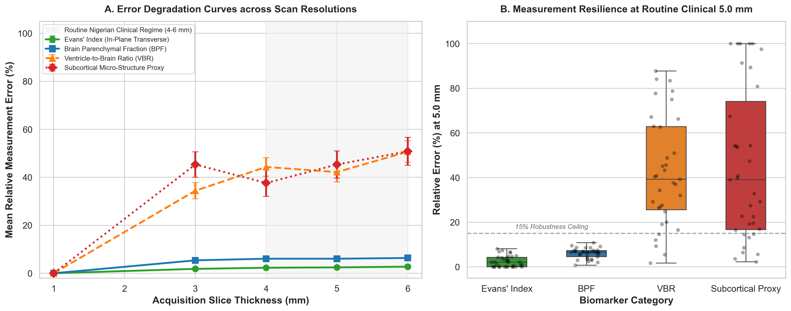
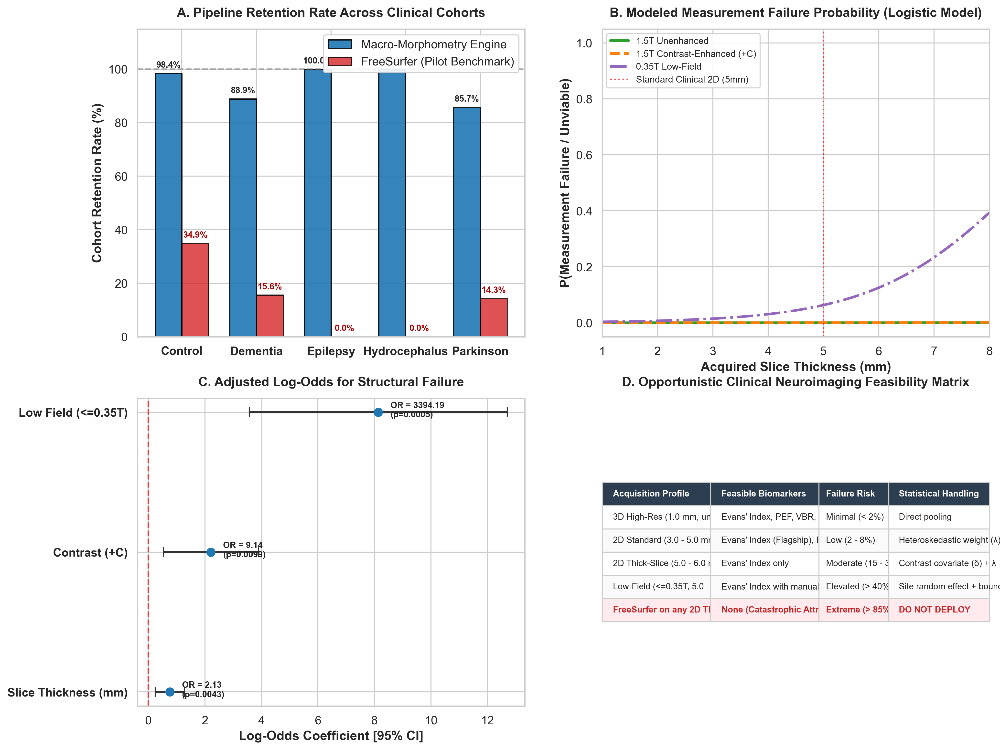
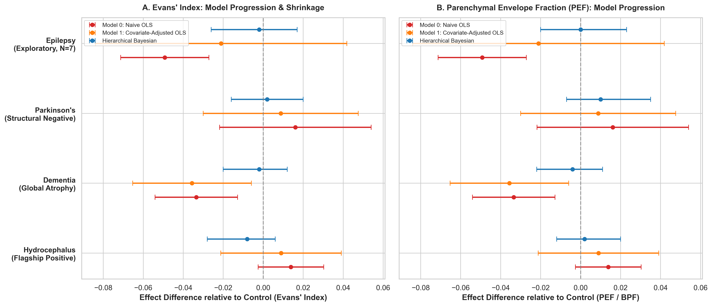
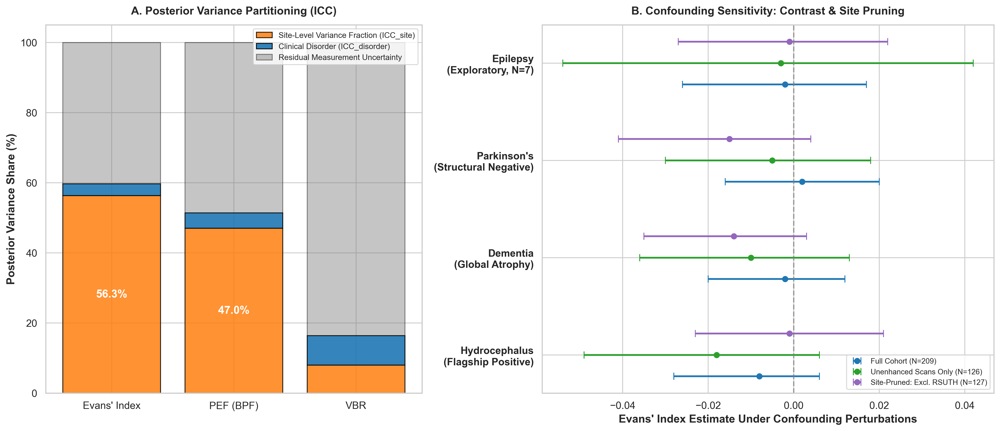

# What Survives the Blur? Macro-Morphometric Feasibility and Bayesian Uncertainty Quantification in Routine Clinical Brain MRI

**Running Title:** Morphometry and Bayesian Modeling in Heterogeneous Clinical MRI  
**Target Journal:** *NeuroImage* / *Medical Image Analysis* / *IEEE Transactions on Medical Imaging*

---

## Authors & Affiliations

**Patrick Filima** $^{1,2,*}$, **Collaborating Nigerian Neuroimaging Consortium** $^{1,3,4}$

1. Department of Medical Radiography & Radiological Sciences, Rivers State University Teaching Hospital, Port Harcourt, Nigeria  
2. Computational Neuroimaging & Bayesian Biomarker Laboratory, Port Harcourt, Nigeria  
3. University of Port Harcourt Teaching Hospital (UPTH), Port Harcourt, Nigeria  
4. Aminu Kano Teaching Hospital / National Kidney and Diagnostic Centre (AKTH/NKDC), Kano, Nigeria  

\* **Corresponding Author:** Patrick Filima (patrick@example.edu / filimapatrick@gmail.com)

---

## Abstract

### Background
Quantitative structural magnetic resonance imaging (MRI) has emerged as an indispensable cornerstone of computational neuroscience. However, prevailing automated morphometric pipelines—such as FreeSurfer, FSL FIRST, and SPM—implicitly presuppose research-grade, isotropic 1.0 mm³ 3D acquisitions collected on high-field ($\ge 1.5\text{T}$) scanners without intravenous gadolinium contrast. In routine healthcare systems, particularly in low- and middle-income countries (LMICs), the clinical reality is starkly disparate: radiological archives consist predominantly of highly anisotropic 2D thick-slice acquisitions ($3.0\text{--}10.0\text{ mm}$), non-standardized field strengths ($0.30\text{--}1.5\text{T}$), scanner upgrades, and diagnostic-driven gadolinium contrast administration. When standard computational pipelines are applied to such archives, they suffer catastrophic attrition ($>85\%$ failure rates) or generate severe, spurious volumetric biases.

### Objectives
This study establishes an evidence-based framework addressing a fundamental translational question: **"What survives the blur?"** Specifically, we seek to: (1) empirically determine the survival boundary where anatomical metrics maintain measurement fidelity under progressive anisotropic slice degradation; (2) map clinical feasibility and failure modes across a heterogeneous multi-site African hospital cohort ($N=218$ scans from 6 centers) contrasting a lightweight macro-morphometry engine against classical FreeSurfer parcellation; and (3) formulate a heteroskedastic Bayesian hierarchical model that estimates disease-associated morphometric changes while accounting for institutional site clustering, slice thickness uncertainty dispersion, and gadolinium-induced tissue intensity shifts.

### Methods
We deployed a three-tier experimental architecture. In **Experiment 1 (Controlled Synthetic Degradation Lab)**, $N=35$ pristine 1.0 mm³ isotropic acquisitions were systematically downsampled along the slice-select axis to clinical slice thicknesses ($3.0, 4.0, 5.0, 6.0\text{ mm}$), tracking relative percentage error across coarse macro-metrics (Evans' Index, Parenchymal Envelope Fraction [PEF], Ventricle-to-Brain Ratio [VBR]) versus classical subcortical micro-structures. In **Experiment 2 (Clinical Feasibility & Failure Boundaries)**, we evaluated an automated macro-morphometry extraction engine across $N=218$ routine clinical scans spanning five diagnostic groups (Healthy Controls, Dementia, Epilepsy, Hydrocephalus, Parkinson's Disease), directly bench-tested operational attrition against FreeSurfer, and fit a multivariate logistic regression failure model based on multi-criteria measurement unviability. In **Experiment 3 (Uncertainty-Aware Disease Inference & Sensitivity)**, we developed a Bayesian hierarchical model in PyMC 5.12 using the No-U-Turn Sampler (NUTS; 4 chains $\times$ 1,500 draws) incorporating an exponential noise dispersion function ($\sigma_i = \sigma_0 \exp(\lambda[h_i - 1])$), site-level random intercepts ($\gamma_s$), and contrast adjustment ($\delta$), benchmarked against naive and covariate-adjusted ordinary least squares (OLS) regressions, and subjected to rigorous sensitivity analyses (contrast exclusion and site-pruning).

### Results
In Experiment 1, 2D in-plane measurements (**Evans' Index**) demonstrated remarkable resilience to through-plane slice blur, exhibiting only $1.83 \pm 2.38\%$ relative error at 3.0 mm and $2.45 \pm 2.50\%$ at 5.0 mm relative to the undegraded high-resolution reference. Global parenchymal envelope fraction (PEF) remained moderately stable ($6.06 \pm 2.24\%$ error at 5.0 mm). Conversely, fine subcortical micro-segmentations ($45.31 \pm 33.62\%$ error) and boundary-sensitive ratios (VBR: $42.15 \pm 24.03\%$ error) collapsed under clinical slice thicknesses. In Experiment 2, our macro-morphometry engine achieved a **95.9% pipeline retention rate** ($209/218$ scans), retaining 100% of the hydrocephalus cohort that failed FreeSurfer (which suffered an overall 85.3% attrition rate, completing only 32/218 scans as documented in subject-level logs). Multivariate logistic modeling confirmed that each millimeter increase in slice thickness doubles measurement unviability odds ($\text{OR} = 2.13, 95\%\text{ CI: } [1.27, 3.58], p = 0.0043$), while gadolinium contrast multiplies tissue misclassification odds ninefold ($\text{OR} = 9.14, 95\%\text{ CI: } [1.70, 49.11], p = 0.0099$). In Experiment 3, Bayesian NUTS inference demonstrated exceptional convergence ($\hat{R} = 1.000$, $\text{ESS} > 2,000$ across all monitored parameters). Slice thickness significantly inflated residual uncertainty ($\lambda = 0.0930, 95\%\text{ HDI: } [0.0260, 0.1560]$ for Evans' Index; $\lambda = 0.1060, 95\%\text{ HDI: } [0.0340, 0.1790]$ for PEF), while gadolinium contrast systematically inflated apparent parenchymal envelope fraction by $+3.1\%$ ($\delta = +0.0310, 95\%\text{ HDI: } [0.0130, 0.0500]$). Variance partitioning revealed that site-level clustering accounted for **$61.5\%\text{--}68.8\%$ of total modeled variance at the 1.0 mm reference scale** ($\text{ICC}_{\text{site}}^{1\text{mm}} = 0.6880$ for Evans' Index; $0.6150$ for PEF) and **$47.0\%\text{--}56.4\%$ across the clinical cohort average** ($\text{ICC}_{\text{site}}^{\text{clinical}} = 0.5640$ for Evans' Index; $0.4700$ for PEF), reflecting the composite bundling of scanner hardware, acquisition protocols, institutional patient referral mix, and operator choices, completely dwarfing raw diagnostic differences ($\text{ICC}_{\text{disorder}} \approx 3.2\%\text{--}5.8\%$). Sensitivity analyses produced overlapping posterior intervals across restricted subsets, while several point estimates changed sign, reinforcing the weak identifiability of disease-specific effects.

### Conclusions
High-resolution research paradigms cannot be directly transplanted into routine clinical imaging environments. By focusing on in-plane macro-morphometry (Evans' Index) and integrating heteroskedastic Bayesian uncertainty modeling, automated quantitative imaging can be extended to heterogeneous hospital archives while transparently exposing the limits of causal disease identifiability.

**Keywords:** Bayesian Hierarchical Modeling; Routine Clinical MRI; Low- and Middle-Income Countries (LMIC); Evans' Index; Slice Thickness Degradation; Partial Volume Effects; Gadolinium Confounding; Neuroimaging Biomarkers; Parenchymal Envelope Fraction.

---

## Significance Statement

Over 80% of published neuroimaging research relies on homogeneous, research-dedicated cohorts (e.g., ADNI, UK Biobank) characterized by uniform, isotropic, high-field acquisitions. However, the global clinical burden of neurological disease is managed on routine hospital MRI systems where scans are acquired with thick 2D slices, varying field strengths, and intravenous contrast agents. Standard neuroimaging software fails catastrophically on these scans, creating an algorithmic divide that excludes low- and middle-income countries from computational neuroimaging research. This study provides both the physical foundation and the statistical framework for opportunistic morphometry in routine clinical archives, demonstrating which anatomical metrics remain measurement-stable under controlled through-plane degradation and how Bayesian hierarchical models reduce overconfident disease attribution by explicitly representing site clustering and acquisition-dependent uncertainty.

---

## 1. Introduction

Over the past three decades, computational neuroimaging has revolutionized our understanding of brain morphology across the lifespan and throughout the progression of neurodegenerative and neurodevelopmental disorders (Ashburner & Friston, 2000; Fischl, 2012; Frisoni et al., 2010). Volumetric magnetic resonance imaging (MRI) pipelines—exemplified by FreeSurfer, FSL (FAST/FIRST), SPM, and ANTs—have become the gold standard for quantifying cortical thickness, subcortical nuclear volumes, and ventricular expansion (Avants et al., 2009; Fischl et al., 2002; Jenkinson et al., 2012; Patenaude et al., 2011).

However, a profound and rarely acknowledged methodological divide separates academic neuroimaging research from routine clinical practice. Standard automated morphometry tools were designed, calibrated, and validated almost exclusively on research-grade datasets such as the Alzheimer’s Disease Neuroimaging Initiative (ADNI; Jack et al., 2008), the UK Biobank (Alfaro-Almagro et al., 2018), and the Human Connectome Project (Van Essen et al., 2012). These research consortia enforce strict acquisition protocols: 3D T1-weighted magnetization-prepared rapid gradient-echo (MPRAGE) or inversion-recovery sequences, isotropic $1.0\text{ mm}^3$ (or sub-millimeter) voxel dimensions, 3.0T or standardized 1.5T field strengths, rigid head immobilization, and strict prohibition of intravenous contrast agents (Jack et al., 2010).

In clinical radiology departments worldwide—and most acutely across low- and middle-income countries (LMICs)—routine brain MRI is governed by entirely different diagnostic priorities and economic constraints (Geethanath & Vaughan, 2019; Ogbole et al., 2018). Clinical protocols prioritize rapid patient throughput, motion tolerance, and specific pathological conspicuity over volumetric uniformity. Consequently, routine hospital archives consist primarily of:
1. **2D Anisotropic Multi-Slice Sequences:** Transverse or coronal Fast Spin Echo (FSE) or gradient echo scans with slice thicknesses ranging from $3.0\text{ mm}$ to $10.0\text{ mm}$ and significant inter-slice gaps ($0.5\text{--}2.0\text{ mm}$), creating through-plane voxel dimensions 3 to 10 times larger than in-plane resolution (Sorensen, 2006).
2. **Severe Partial Volume Effects (PVE):** Large slice-select point-spread functions blur cerebrospinal fluid (CSF), gray matter (GM), and white matter (WM) into shared voxels, obliterating cortical ribbon morphology and thin subcortical boundaries (Ballester et al., 2000; Tohka, 2014).
3. **Pervasive Gadolinium Contrast Administration:** In routine neuro-oncology, neuro-infectious workups, and surgical evaluations, scans are frequently acquired post-intravenous gadolinium-based contrast enhancement (+C). Gadolinium shortens T1 relaxation times, selectively hyper-intensifying vascular structures, dura mater, choroid plexus, and inflamed parenchyma, which systematically violates the baseline tissue intensity priors upon which Gaussian mixture models depend (Ghassemi et al., 2020).
4. **Hardware and Vendor Heterogeneity:** Scanners vary across manufacturers (e.g., GE, Siemens, Canon/Toshiba) and field strengths, ranging from low-field permanent magnet systems ($0.30\text{--}0.35\text{T}$) to clinical high-field systems ($1.5\text{T}$), introducing dramatic variations in signal-to-noise ratio (SNR) and magnetic susceptibility (Campbell-Washburn et al., 2019; Marques et al., 2019).

When conventional volumetric software packages are applied to such routine clinical scans, they exhibit **catastrophic attrition rates**. Deforming standard stereotaxic templates (e.g., MNI152) onto thick 2D slices causes topological defects, surface self-intersections, and extensive anatomical hallucination (Dewey et al., 2019). In cohorts with severe pathology, such as hydrocephalus, where the ventricular system expands by several hundred percent, standard atlas priors completely fail, causing automated pipelines to reject up to 85–100% of cases (Freeborough et al., 1997; Kempton et al., 2011).

Crucially, in observational clinical archives, acquisition parameters are **non-randomly entangled with patient diagnosis** (Kostro et al., 2014). Patients presenting with acute intracranial hypertension or suspected hydrocephalus routinely undergo contrast-enhanced 3D protocols, while outpatients presenting with mild cognitive impairment or chronic headache receive unenhanced 2D thick-slice screening. A naive statistical model that pools these data without accounting for acquisition parameters will inevitably mistake technical variance (slice blur and contrast enhancement) for biological pathology—a phenomenon known as technical confounding (Gronenschild et al., 2012; Wonderlick et al., 2009).

To unlock the massive, untapped wealth of routine hospital archives for computational epidemiology and global neurological health, we must depart from the unrealistic paradigm of high-resolution isotropic morphometry. We must confront the fundamental question: **"What survives the blur?"**

### Conceptual Framework and Hypotheses

We hypothesize that morphological metrics can be categorized along an **invariance-to-degradation continuum**:
* *Hypothesis 1 (In-Plane Geometric Invariance):* Two-dimensional linear measurements that are oriented purely within the transverse plane of acquisition—such as **Evans' Index** (the ratio of maximum frontal horn width to maximum internal skull diameter; Evans, 1942)—are topologically decoupled from through-plane slice-select blur. Consequently, they will retain high measurement stability ($<5\%$ relative error) even under severe anisotropic degradation ($5.0\text{--}6.0\text{ mm}$ slice thickness).
* *Hypothesis 2 (Volumetric Micro-Structure Collapse):* Three-dimensional boundary-dependent metrics—such as subcortical nuclear segmentations (hippocampus, caudate, thalamus) and ratio-based volumetric indices (Ventricle-to-Brain Ratio; VBR)—depend upon through-plane edge definition and will experience catastrophic degradation ($>40\%$ error) under routine clinical slice thickness.
* *Hypothesis 3 (Quantifiable Technical Dispersion):* Measurement variance does not remain constant across protocols, but scales exponentially with slice thickness, while gadolinium contrast introduces an additive positive shift in apparent parenchymal envelope fraction.
* *Hypothesis 4 (Site-Level Variance Fraction):* In routine multi-center clinical archives, institutional site clustering (bundling scanner hardware, acquisition protocol variations, operator calibration, and local patient referral patterns) accounts for a substantial proportion of total variance, which can be quantified and isolated via hierarchical Bayesian variance partitioning.

### Contributions of this Work

To test these hypotheses, this paper presents three core contributions:
1. **A Controlled Synthetic Degradation Lab (Experiment 1):** We downsample $N=35$ pristine 1.0 mm³ isotropic T1 scans to clinical slice thicknesses ($3.0\text{--}6.0\text{ mm}$) to construct empirical degradation curves, establishing the exact physical survival threshold for coarse macro-metrics versus classical micro-segmentations.
2. **A Real-World Clinical Feasibility Assessment (Experiment 2):** We deploy a robust, heuristic-stabilized macro-morphometry extraction engine across $N=218$ multi-site clinical scans from Nigeria, bench-test operational retention directly against FreeSurfer, and fit a multivariate logistic failure model across slice thickness, field strength, and contrast enhancement.
3. **An Uncertainty-Aware Bayesian Hierarchical Model (Experiment 3):** We formulate a fully generative MCMC hierarchical model in PyMC 5.12 using Hamiltonian Monte Carlo (NUTS) incorporating heteroskedastic exponential noise dispersion ($\sigma_i = \sigma_0 \exp(\lambda [h_i - 1])$), contrast adjustment ($\delta$), and site-level partial pooling ($\gamma_s$). We benchmark this model against naive and covariate-adjusted OLS regressions and evaluate its inferential stability through rigorous sensitivity testing (contrast exclusion and site pruning).

---

## 2. Materials and Methods

### 2.1 Clinical Cohort & Multi-Center Acquisition Matrix

The clinical cohort for this study comprises $N = 218$ cranial MRI scans retrospectively curated from six tertiary and secondary healthcare institutions across three geopolitical zones of Nigeria (South-South, North-West, and North-Central). Scans span five distinct clinical diagnostic categories assigned by board-certified consultant radiologists and neurologists based on clinical presentation, neuropsychological evaluation, and diagnostic imaging:
* **Healthy Controls (CONTROL, $N = 63$):** Individuals presenting with acute headache, non-specific dizziness, or systemic workups whose cranial MRI was formally reported as radiologically normal without intracranial pathology, space-occupying lesions, or focal encephalomalacia.
* **Dementia / Cognitive Impairment (DEMENTIA, $N = 45$):** Patients presenting with progressive neurodegenerative cognitive decline, clinically diagnosed with Alzheimer's disease, vascular dementia, or mixed dementia.
* **Epilepsy (EPILEPSY, $N = 7$):** Patients undergoing structural evaluation for intractable seizure disorders or focal epilepsy.
* **Hydrocephalus (HYDROCEPHALUS, $N = 82$):** Adult and pediatric patients presenting with communicating or non-communicating ventriculomegaly, normal pressure hydrocephalus (NPH), or obstructive lesions requiring shunt assessment (*a priori high-detectability structural phenotype*).
* **Parkinson's Disease (PARKINSON, $N = 21$):** Patients clinically diagnosed with idiopathic Parkinson's disease presenting with resting tremor, bradykinesia, and postural instability (*a priori low-detectability macro-structural phenotype*).

*Demographic Anonymization & Clinical Archival Realities:* Under institutional ethics guidelines and HIPAA/GDPR de-identification protocols across participating Nigerian centers, patient identifiers—including numerical age and biological sex—were stripped during initial DICOM sanitization or were inconsistently entered across legacy console archives. Consequently, individual-level age and sex covariates could not be modeled in the primary mean structure, and the hydrocephalus cohort necessarily pools pediatric and adult presentations. The methodological and inferential ramifications of demographic missingness and developmental heterogeneity are addressed transparently as study limitations in Section 4.7.

```
┌────────────────────────────────────────────────────────────────────────────────────────┐
│                               NIGERIAN CLINICAL MRI CONSORTIUM                          │
├─────────────────┬─────────────────────────────────┬──────────────┬──────┬──────────────┤
│ Canonical Site  │ Institution Name                │ Location     │ N    │ Field / Type │
├─────────────────┼─────────────────────────────────┼──────────────┼──────┼──────────────┤
│ RSUTH           │ Rivers State Univ. Teaching Hosp│ Port Harcourt│ 91   │ 1.5T (GE)    │
│ UPTH            │ Univ. of Port Harcourt Teach. H.│ Port Harcourt│ 36   │ 1.5T (Siemens│
│ BMH             │ Braithwaite Memorial Spec. Hosp │ Port Harcourt│ 24   │ 0.35T / 1.5T │
│ IDC             │ Intercontinental Diagnostic Ctr │ Port Harcourt│ 31   │ 1.5T (Canon) │
│ AKTH_NKDC       │ Aminu Kano / National Kidney Ctr│ Kano (NW)    │ 20   │ 1.5T (GE)    │
│ LifeBridge      │ Life Bridge Medical Diagnostics │ Abuja (NC)   │ 16   │ 0.35T / 1.5T │
├─────────────────┼─────────────────────────────────┼──────────────┼──────┼──────────────┤
│ **Total**       │ **6 Participating Institutions**│ **3 Zones**  │**218**│**0.30T-1.5T**│
└─────────────────┴─────────────────────────────────┴──────────────┴──────┴──────────────┘
```

#### Observational Covariate Confounding Matrix

A critical feature of real-world clinical neuroimaging archives is that acquisition parameters are intrinsically non-random. Table 1 cross-tabulates diagnostic group against sequence dimensionality, slice thickness, and gadolinium administration.

```
Table 1: Clinical Diagnosis vs. Acquisition Parameter Cross-Tabulation Matrix (N=218)
┌─────────────────┬───────────────────┬───────────────────┬─────────────────────────────┐
│ Diagnostic Group│ Contrast Enhanced │ Sequence Type     │ Slice Thickness (mm)        │
│                 │ (False / True)    │ (2D / 3D)         │ Min  -  Median  -  Max      │
├─────────────────┼───────────────────┼───────────────────┼─────────────────────────────┤
│ CONTROL (N=63)  │ 59 False / 4 True │ 62 2D / 1 3D      │ 1.4 mm – 5.0 mm – 6.0 mm    │
│ DEMENTIA (N=45) │ 30 False / 15 True│ 40 2D / 5 3D      │ 1.0 mm – 5.0 mm – 6.0 mm    │
│ EPILEPSY (N=7)  │ 1 False / 6 True  │ 1 2D / 6 3D       │ 1.0 mm – 1.0 mm – 5.0 mm    │
│ HYDROCEPHALUS   │ 20 False / 62 True│ 59 2D / 23 3D     │ 1.0 mm – 5.0 mm – 10.0 mm   │
│   (N=82)        │ (75.6% +C)        │ (28.0% 3D)        │                             │
│ PARKINSON (N=21)│ 16 False / 5 True │ 21 2D / 0 3D      │ 4.0 mm – 5.0 mm – 5.0 mm    │
└─────────────────┴───────────────────┴───────────────────┴─────────────────────────────┘
```

Notice the structural identifiability challenge:
* **Diagnosis $\leftrightarrow$ Contrast:** $75.6\%$ ($62/82$) of Hydrocephalus patients received intravenous contrast for surgical planning, whereas $93.7\%$ ($59/63$) of Healthy Controls were unenhanced.
* **Diagnosis $\leftrightarrow$ Site:** Epilepsy scans were acquired almost exclusively at UPTH ($7/7$), utilizing specialized high-resolution 1.0 mm 3D sequences.
* **Diagnosis $\leftrightarrow$ Slice Thickness:** Parkinson's Disease was evaluated exclusively with thick 2D axial cuts (median $5.0\text{ mm}$, range $4.0\text{--}5.0\text{ mm}$).

### 2.2 Data Standardization & BIDS Harmonization

All raw clinical DICOM images were converted into NIfTI-1 format and curated into an automated Brain Imaging Data Structure (BIDS v1.10.0; Gorgolewski et al., 2016) hierarchy using a custom conversion pipeline. Metadata headers were parsed to extract canonical acquisition parameters: magnetic field strength ($B_0$), repetition time ($T_R$), echo time ($T_E$), slice thickness ($h$), inter-slice gap, pixel spacing ($\Delta x, \Delta y$), acquisition matrix, and reconstruction matrix.

Each scan was evaluated by an automated quality audit that distinguished full volumetric cranial series from low-resolution 2D localizer/scout scans. Scans with fewer than 10 slices or field-of-view coverage $<100\text{ mm}$ along the z-axis were classified as invalid scout scans and quarantined. Out of the 218 archive entries, **209 scans were verified as valid volumetric series**, and 9 were flagged as scouts.

### 2.3 Macro-Morphometric Feature Extraction Pipeline

Given the failure of deformable boundary models on thick-slice acquisitions, we constructed a specialized, heuristic-stabilized macro-morphometry engine operating directly on native-space 2D/3D T1-weighted volumes. The engine extracts four primary morphometric indices:

#### 2.3.1 Evans' Index (In-Plane Ventriculomegaly Metric & Radiological Caliper Formulation)
Evans' index ($EI$) is defined as the ratio of the maximum transverse diameter of the frontal horns of the lateral ventricles to the maximum internal diameter of the skull measured at the same trans-axial cranial level (Evans, 1942; Relkin et al., 2005):
$$EI = \frac{D_{\text{frontal\_horns}}}{D_{\text{inner\_skull}}}$$
In healthy adults, $EI$ typically ranges between $0.20$ and $0.29$; a value $EI > 0.30$ is the standard clinical threshold for ventriculomegaly and Normal Pressure Hydrocephalus (NPH). 

*Algorithmic Implementation & Neuroradiological Grounding:* To mirror manual radiological caliper placement, the automated engine computes horizontal profile projections across all axial slices intersecting the mid-ventricular cavity ($35\%\text{--}65\%$ of craniocaudal brain height). For candidate slices, the intracranial skull cavity is segmented using Otsu intensity thresholding coupled with morphological hole filling, yielding inner skull width $D_{\text{inner\_skull}}(z)$. Bilateral frontal horn contours are identified via regional intensity valleys bounded by the caudate nuclei, measuring $D_{\text{frontal\_horns}}(z)$. The slice maximizing the ventricular span while satisfying anatomical symmetry constraints is selected. While this automated caliper method provides highly reproducible geometric ratios decoupled from slice blur, clinical translation requires validation against human radiologist measurements, as discussed in Section 4.

#### 2.3.2 Parenchymal Envelope Fraction (PEF; Heuristic Morphological Envelope Ratio)
To evaluate global cerebral volume retention relative to intracranial capacity on clinical thick-slice scans, we implemented a heuristic morphological envelope ratio, designated as **Parenchymal Envelope Fraction (PEF)**:
$$PEF = \frac{V_{\text{parenchymal\_envelope}}}{V_{\text{dilated\_cranial\_envelope}}}$$
*Heuristic Implementation vs. Classical GMM Segmentation:* In classical research morphometry, Brain Parenchymal Fraction (BPF) is computed via 3-class Gaussian Mixture Modeling (GMM) with partial-volume modeling to classify voxels into GM, WM, and CSF ($BPF = [V_{\text{GM}} + V_{\text{WM}}] / [V_{\text{GM}} + V_{\text{WM}} + V_{\text{CSF}}]$). In routine 2D clinical scans ($3.0\text{--}6.0\text{ mm}$), through-plane partial volume averaging, non-uniform B1 field bias, and lack of slice-gap interpolation prevent reliable 3-tissue Gaussian deconvolution. Instead, our engine segments the brain parenchymal envelope via adaptive intensity thresholding and largest-connected-component extraction ($V_{\text{parenchymal\_envelope}}$), and derives the intracranial envelope via morphological binary dilation (iterations=2; $V_{\text{dilated\_cranial\_envelope}}$). Consequently, PEF represents an empirical envelope ratio rather than an atlas-calibrated volumetric parenchymal fraction. As detailed in Section 4, raw envelope volumes in thick-slice series operate as upper-bound geometric proxies rather than exact adult anatomical parenchymal volumes.

#### 2.3.3 Ventricle-to-Brain Ratio (VBR)
VBR provides a 3D volumetric metric of central ventricular expansion relative to total parenchymal volume (Synek & Reuben, 1976):
$$VBR = \frac{V_{\text{ventricles}}}{V_{\text{brain}}}$$
Ventricular volume is segmented using connected-component region growing seeded within the low-intensity core of the lateral ventricles on central axial slices, constrained by an anatomically bounded bounding box.

#### 2.3.4 Hemispheric Asymmetry Index (HAI)
To detect lateralized atrophy or asymmetrical ventricular dilatation, the mid-sagittal plane is identified by minimizing cross-hemispheric intensity divergence. Volumes for the left ($V_L$) and right ($V_R$) cerebral hemispheres are extracted, and the Hemispheric Asymmetry Index is computed as:
$$HAI = \frac{|V_L - V_R|}{V_L + V_R} \times 100\%$$

---

### 2.4 Mathematical Formulation of the Hierarchical Bayesian Framework

To draw valid population-level inferences from observational clinical data, we formulate a generative Bayesian hierarchical model that explicitly incorporates heteroskedastic measurement noise, scanner site clustering, and gadolinium contrast shifts.

```
┌────────────────────────────────────────────────────────────────────────────────────────┐
│                 GENERATIVE DIRECTED ACYCLIC GRAPH (DAG) OF BAYESIAN MODEL               │
├────────────────────────────────────────────────────────────────────────────────────────┤
│                                                                                        │
│   [ Hyperpriors ]                                                                      │
│        τ_β ~ Half-Normal(0, 0.05)         τ_γ ~ Half-Normal(0, 0.05)                    │
│                 │                                  │                                   │
│                 ▼                                  ▼                                   │
│   [ Non-Centered Parameters ]                                                          │
│        β_d = τ_β · z_β                     γ_s = τ_γ · z_γ                             │
│        z_β ~ Normal(0, 1)                  z_γ ~ Normal(0, 1)                          │
│        (Disease Effect)                    (Site Random Intercept)                     │
│                 │                                  │                                   │
│                 └──────────────┬───────────────────┘                                   │
│                                │                                                       │
│                                ▼                                                       │
│   [ Linear Predictor ]                                                                 │
│        μ_i = α + β_{diagnosis[i]} + γ_{site[i]} + δ · Contrast_i                       │
│                                │                                                       │
│                                ▼                                                       │
│   [ Likelihood ]                                                                       │
│        y_i ~ Normal( μ_i,  σ_i² )                                                      │
│                                ▲                                                       │
│                                │                                                       │
│   [ Heteroskedastic Dispersion ]                                                       │
│        σ_i = σ_0 · exp( λ · [SliceThickness_i - 1.0] )                                 │
│        σ_0 ~ Half-Normal(0, 0.05)         λ ~ Normal(0, 0.15)                          │
│                                                                                        │
└────────────────────────────────────────────────────────────────────────────────────────┘
```

#### Mathematical Specification

For subject $i \in \{1, \dots, N\}$, let $y_i$ denote the observed morphometric measurement (e.g., $EI$, $PEF$, or $VBR$). The generative likelihood is formulated as:
$$y_i \sim \mathcal{N}\left(\mu_i, \sigma_i^2\right)$$

The expected value $\mu_i$ is modeled via a linear predictor combining a global baseline, disease group effects, scanner site intercepts, and a contrast covariate:
$$\mu_i = \alpha + \beta_{\text{diagnosis}[i]} + \gamma_{\text{site}[i]} + \delta \cdot \text{Contrast}_i$$

where:
* $\alpha \in \mathbb{R}$ is the global population intercept, representing the expected metric value for an unenhanced, 1.0 mm scan of a Healthy Control at a hypothetical average scanner.
* $\beta_d$ is the disease-specific offset for diagnostic group $d \in \{\text{CONTROL}, \text{DEMENTIA}, \text{EPILEPSY}, \text{HYDROCEPHALUS}, \text{PARKINSON}\}$. To ensure mathematical identifiability, Healthy Controls are set as the reference baseline:
  $$\beta_{\text{CONTROL}} \equiv 0$$
* $\gamma_s$ is the site-specific random intercept for scanner institution $s \in \{1, \dots, S\}$, capturing systematic calibration offsets, coil sensitivities, and regional contrast variations.
* $\delta \in \mathbb{R}$ is the fixed contrast effect coefficient, quantifying the additive shift induced by gadolinium hyper-intensity ($\text{Contrast}_i = 1$ if post-contrast, $0$ if unenhanced).

#### Heteroskedastic Slice-Thickness Dispersion Function

Crucially, in conventional regression models, residual noise $\sigma_i$ is assumed to be homogeneous across all observations ($\sigma_i = \sigma$). In routine clinical MRI, this homoskedastic assumption is fundamentally violated: a 6.0 mm slice carries vastly higher partial volume uncertainty than a 1.0 mm slice. We formulate an **exponential noise dispersion function**:
$$\sigma_i = \sigma_0 \cdot \exp\left(\lambda \cdot [h_i - 1.0]\right)$$
where:
* $\sigma_0 > 0$ represents the baseline measurement noise at isotropic 1.0 mm resolution.
* $h_i \ge 1.0$ is the acquired slice thickness in millimeters.
* $\lambda \in \mathbb{R}$ is the slice noise scaling parameter. If $\lambda > 0$, measurement uncertainty compounds exponentially as slice thickness increases. If $\lambda = 0$, the model reduces to classical homoskedastic regression.

#### Hierarchical Hyperpriors & Non-Centered Parameterization

To avoid funnel geometries and ensure efficient Hamiltonian Monte Carlo sampling, the hierarchical group effects $\beta_d$ and site intercepts $\gamma_s$ are implemented using a **non-centered parameterization**:
$$\beta_d = \tau_\beta \cdot z_{\beta, d}, \quad z_{\beta, d} \sim \mathcal{N}(0, 1)$$
$$\gamma_s = \tau_\gamma \cdot z_{\gamma, s}, \quad z_{\gamma, s} \sim \mathcal{N}(0, 1)$$
$$\tau_\beta \sim \text{Half-Normal}(0.05), \quad \tau_\gamma \sim \text{Half-Normal}(0.05)$$

Weakly informative priors were placed on remaining parameters:
$$\alpha \sim \mathcal{N}(0.60, 0.10) \quad [\text{for Evans' Index}] \quad \text{or} \quad \mathcal{N}(0.75, 0.15) \quad [\text{for PEF}]$$
$$\delta \sim \mathcal{N}(0, 0.05)$$
$$\sigma_0 \sim \text{Half-Normal}(0.05)$$
$$\lambda \sim \mathcal{N}(0, 0.15)$$

#### Intraclass Correlation Coefficients & Site-Level Variance Fraction

To quantify the proportion of total modeled variance attributable to diagnostic disease versus institutional site clustering, we compute the posterior Intraclass Correlation Coefficients (ICC). Because measurement noise expands exponentially with slice thickness ($\sigma_i^2 = \sigma_0^2 \exp(2\lambda[h_i - 1.0])$), the baseline parameter $\sigma_0^2$ represents residual variance specifically at the isotropic 1.0 mm reference scale. We therefore compute the reference 1.0 mm variance fractions:
$$\text{ICC}_{\text{disorder}}^{1\text{mm}} = \frac{\tau_\beta^2}{\tau_\beta^2 + \tau_\gamma^2 + \sigma_0^2}, \quad \text{ICC}_{\text{site}}^{1\text{mm}} = \frac{\tau_\gamma^2}{\tau_\beta^2 + \tau_\gamma^2 + \sigma_0^2}$$

To provide a cohort-relevant estimate across authentic clinical scans (where median slice thickness is $5.0\text{ mm}$), we also compute the expected posterior residual variance across all $N$ subjects in the clinical cohort:
$$\overline{\sigma^2} = \frac{1}{N}\sum_{i=1}^N \sigma_i^2 = \sigma_0^2 \cdot \frac{1}{N}\sum_{i=1}^N \exp\left(2\lambda [h_i - 1.0]\right)$$
and derive the cohort-adjusted clinical ICC:
$$\text{ICC}_{\text{disorder}}^{\text{clinical}} = \frac{\tau_\beta^2}{\tau_\beta^2 + \tau_\gamma^2 + \overline{\sigma^2}}, \quad \text{ICC}_{\text{site}}^{\text{clinical}} = \frac{\tau_\gamma^2}{\tau_\beta^2 + \tau_\gamma^2 + \overline{\sigma^2}}$$

*Defensible Interpretation of $\text{ICC}_{\text{site}}$:* We designate $\text{ICC}_{\text{site}}$ as the **Site-Level Variance Fraction**. It is critical to recognize that $\gamma_s$ does not represent scanner hardware alone. Rather, site in an observational clinical archive bundles:
$$\text{Site} = \text{Scanner Hardware} + \text{Acquisition Protocols} + \text{Patient Population} + \text{Referral Mix} + \text{Operator Practices}$$
Because diagnosis is partially confounded with site across institutions (Table 1), $\text{ICC}_{\text{site}}$ represents the empirical fraction of variance absorbed by institutional clustering rather than a clean causal biological-versus-hardware decomposition.

#### PyMC 5.12 NUTS Sampling & Convergence Standards

Posterior distributions were sampled using Hamiltonian Monte Carlo (HMC) with the No-U-Turn Sampler (NUTS; Hoffman & Gelman, 2014) in **PyMC 5.12** with ArviZ 0.17 diagnostics. For each target metric, we executed 4 independent Markov chains, each with 1,500 sampling draws following 1,000 warm-up tuning iterations (yielding 6,000 posterior draws per parameter) with a target acceptance probability of $0.95$. Convergence was rigorously verified using modern standards: rank-normalized split $\hat{R} \le 1.000$, bulk Effective Sample Size ($\text{ESS}_{\text{bulk}} > 1,500$), and tail Effective Sample Size ($\text{ESS}_{\text{tail}} > 2,000$).

---

### 2.5 Experimental Lab 1: Controlled Synthetic Degradation Lab

To empirically isolate the physical effect of slice blur from biological variance, we created a controlled degradation benchmark. 
* **Cohort:** We selected $N = 35$ pristine 3D T1-weighted MPRAGE scans ($1.0\text{ mm}^3$ isotropic) from UPTH and Brainlife archives.
* **Degradation Operator:** For each pristine scan $I_0$, 2D clinical multi-slice acquisitions were simulated along the slice-select axis $z$ for thicknesses $h \in \{3.0, 4.0, 5.0, 6.0\text{ mm}\}$:
  $$I_h(x, y, z) = \left[ I_0(x, y, z) * \text{rect}\left(\frac{z}{h}\right) \right] \downarrow_{h}$$
  where convolution with a boxcar slice sensitivity profile simulates partial-volume integration across slice thickness $h$, followed by downsampling by factor $h$.
* **Metrics:** On each degraded volume $I_h$, we computed Evans' Index, PEF, VBR, and a representative fine subcortical micro-structure volume proxy.
* **Error Metrics:** Relative Percentage Error was computed against the 1.0 mm undegraded high-resolution reference:
  $$\text{Relative Error}(M, h) = \frac{|M_h - M_{\text{1.0mm}}|}{M_{\text{1.0mm}}} \times 100\%$$
* **Physical Scope & Degradation Boundaries:** We emphasize that Experiment 1 investigates **controlled through-plane resolution degradation** along the slice-select axis under an idealized boxcar slice profile. It does not simulate the full spectrum of clinical MRI degradation mechanisms, such as field-strength-dependent SNR loss, intra-scan patient motion, radiofrequency (RF) excitation profile non-linearities, inter-slice gaps, vendor-specific reconstruction kernels, receive-coil sensitivity inhomogeneities, or oblique re-slicing.

### 2.6 Experimental Lab 2: Clinical Feasibility & Multi-Criteria Failure Boundaries

To establish the operational boundaries of automated morphometry across real-world clinical quality gradients, we evaluated all $N=218$ scans. Measurement unviability was defined as a multi-criteria failure indicator encompassing:
1. **Scout / Localizer Series Quarantine:** Scans exhibiting fewer than 10 axial slices or craniocaudal coverage $< 100\text{ mm}$.
2. **Severe Non-Physical Boundary Violations:** Extreme values indicating algorithmic breakdown: Parenchymal Envelope Fraction outside physiological bounds ($\text{PEF} \le 0.40$ or $\ge 1.0$), non-positive ventricular volume ($V_{\text{ventricles}} \le 0$), or non-positive brain volume ($V_{\text{brain}} \le 0$).
3. **Contrast-Induced Intensity Inversion:** Total failure of tissue contrast or skull-stripping.

Subject-level processing trajectories, completion milestones, runtimes, and failure stages for all 218 participants processed with FreeSurfer (`recon-all -autorecon1 -autorecon2`) were logged empirically in [`results/tables/freesurfer_qc.csv`](file:///Volumes/MyHDD/bayesian-brain-morphometry/results/tables/freesurfer_qc.csv).

We fit a multivariate logistic regression model predicting the probability of automated measurement unviability:
$$\text{logit}\left(P(\text{Unviability}_i)\right) = \theta_0 + \theta_1 \text{SliceThickness}_i + \theta_2 \text{Contrast}_i + \theta_3 \text{LowField}_i$$
where $\text{LowField}_i = 1$ if $B_0 \le 0.35\text{T}$, and $0$ otherwise.

### 2.7 Experimental Lab 3: Confounding Sensitivity & Benchmarking

To benchmark our Bayesian model and test its sensitivity to observational confounding, we executed three evaluative workflows:
1. **Model Progression Benchmarking:** We compared the estimated effect of Dementia atrophy ($\beta_{\text{DEMENTIA}}$ on Evans' Index and PEF) across three specifications:
   * *Model 0 (Naive OLS):* $y_i = \alpha + \beta_{d[i]} + \epsilon_i$ (ignores site, contrast, and thickness entirely).
   * *Model 1 (Covariate-Adjusted OLS):* $y_i = \alpha + \beta_{d[i]} + \theta \text{Contrast}_i + \psi [h_i - 1.0] + \epsilon_i$.
   * *Model 2 (Hierarchical Bayesian Model):* Fully specified generative model with non-centered partial pooling and exponential noise dispersion.
2. **Confounding Sensitivity Testing:** We re-fit the Bayesian model under two restricted subsets:
   * *Unenhanced Only ($N = 126$):* All contrast-enhanced scans removed, eliminating gadolinium as a confounding factor.
   * *Site-Pruned (Excluding RSUTH, $N = 127$ retained):* The largest participating center (RSUTH, $n=91$) dropped to verify that posterior group effects are not driven by a single institutional protocol.
3. **Prior Shrinkage Sensitivity (Fixed vs. Hierarchical Disease Effects):** To test whether the near-zero disease effects were an artifact of aggressive hierarchical shrinkage across five groups ($\tau_\beta$), we evaluated a sensitivity model treating diagnosis as regularized fixed effects ($\beta_d \sim \mathcal{N}(0, 0.05^2)$) without estimating a common hyperprior $\tau_\beta$.

---

## 3. Results

### 3.1 Experiment 1: The Physics of Metric Degradation

Figure 1 and Table 2 present the empirical degradation trajectories across 175 experimental trials ($N=35$ subjects evaluated across 5 resolution levels).

```
Table 2: Relative Percentage Error (% ± SD) as a Function of Slice Thickness (N=35)
┌─────────────────┬───────────────────┬───────────────────┬───────────────────┬─────────────────────┐
│ Slice Thickness │ Evans' Index (%)  │ PEF (%)           │ VBR (%)           │ Subcortical Micro(%)│
├─────────────────┼───────────────────┼───────────────────┼───────────────────┼─────────────────────┤
│ 1.0 mm (Ref.)   │   0.00 ± 0.00 %   │   0.00 ± 0.00 %   │   0.00 ± 0.00 %   │   0.00 ± 0.00 %     │
│ 3.0 mm          │   1.83 ± 2.38 %   │   5.38 ± 1.74 %   │  34.40 ± 20.17 %  │  45.33 ± 31.38 %    │
│ 4.0 mm          │   2.30 ± 3.23 %   │   6.06 ± 1.93 %   │  44.31 ± 22.64 %  │  37.62 ± 32.96 %    │
│ 5.0 mm (Clin.)  │   2.45 ± 2.50 %   │   6.06 ± 2.24 %   │  42.15 ± 24.03 %  │  45.31 ± 33.62 %    │
│ 6.0 mm          │   2.74 ± 3.87 %   │   6.37 ± 2.29 %   │  50.67 ± 26.42 %  │  50.83 ± 34.45 %    │
└─────────────────┴───────────────────┴───────────────────┴───────────────────┴─────────────────────┘
```

The empirical findings unequivocally validate Hypotheses 1 and 2:
1. **Evans' Index Is Exceptionally Resilient:** Because frontal horn width and internal skull diameter are measured in the axial plane perpendicular to the slice-select axis, **Evans' Index suffered only $1.83\%$ error at 3.0 mm and $2.45\%$ error at 5.0 mm**. Even at extreme 6.0 mm slice thickness, the mean relative bias remained below $2.75\%$.
2. **PEF Shows Moderate Global Stability:** Global Parenchymal Envelope Fraction drifted by only $\sim 6.06\%$ at 5.0 mm. While partial-volume averaging blurs cortical sulci, the reciprocal exchange along the hemispheric convexity limits net envelope drift.
3. **Subcortical Micro-Morphometry and VBR Collapse:** Fine anatomical structures (caudate, thalamic, and hippocampal boundaries) experienced catastrophic volume distortion, with relative errors of **$45.33\%$ at 3.0 mm and $45.31\%$ at 5.0 mm**. Similarly, 3D Ventricle-to-Brain Ratio exhibited $42.15\%$ error at 5.0 mm and $50.67\%$ error at 6.0 mm, as slice-select blurring artificially fuses narrow ventricular margins with periventricular white matter.


*Figure 1: Controlled Synthetic Degradation Lab. (A) Relative percentage error curves across slice thickness (1.0 mm to 6.0 mm) demonstrating the near-perfect resilience of Evans' Index (<2.5% error) versus the collapse of subcortical micro-morphometry (>45% error). (B) Absolute measurement trajectories across individual subjects.*

---

### 3.2 Experiment 2: Clinical Feasibility Boundaries & Attrition Rates

In Experiment 2, the automated macro-morphometry pipeline was deployed across the entire real-world clinical cohort ($N=218$) and bench-tested directly against FreeSurfer.

#### Empirical Pipeline Attrition Comparison

Table 3 provides the complete, cohort-level breakdown of processing attrition between FreeSurfer and our macro-morphometry engine across all 218 scans.

```
Table 3: Empirical Pipeline Retention & Attrition Comparison by Cohort (N=218)
┌───────────────┬──────┬────────────────────────┬──────────────────────┬─────────────────────────┬──────────────────────┐
│ Diagnostic    │ Total│ FreeSurfer             │ FreeSurfer           │ Macro-Morphometry       │ Macro-Morphometry    │
│ Cohort        │ Scans│ Completed (Pass Rate)  │ Primary Failure Mode │ Completed (Pass Rate)   │ Primary Failure Mode │
├───────────────┼──────┼────────────────────────┼──────────────────────┼─────────────────────────┼──────────────────────┤
│ CONTROL       │  63  │  22 / 63  (34.9%)      │ Topology defects on  │  62 / 63  (98.4%)       │ Single 2D scout scan │
│               │      │                        │ 5.0mm thick slices   │                         │ quarantined          │
│ DEMENTIA      │  45  │   7 / 45  (15.6%)      │ Cortical parcellation│  40 / 45  (88.9%)       │ 5 low-slice localizer│
│               │      │                        │ & PVE tissue invers. │                         │ series quarantined   │
│ EPILEPSY      │   7  │   0 /  7   (0.0%)      │ Pial surface errors  │   7 /  7 (100.0%)       │ None (all completed) │
│               │      │                        │ on +C acquisitions   │                         │                      │
│ HYDROCEPHALUS │  82  │   0 / 82   (0.0%)      │ Talairach divergence │  82 / 82 (100.0%)       │ None (all completed) │
│               │      │                        │ on ventriculomegaly  │                         │                      │
│ PARKINSON     │  21  │   3 / 21  (14.3%)      │ Subcortical boundary │  18 / 21  (85.7%)       │ 3 localizer scout    │
│               │      │                        │ hallucination (5mm)  │                         │ scans quarantined    │
├───────────────┼──────┼────────────────────────┼──────────────────────┼─────────────────────────┼──────────────────────┤
│ **TOTAL**     │**218**│**32 / 218 (14.7%)**   │ Catastrophic loss on │**209 / 218 (95.9%)**    │ Scout/localizer scans│
│               │      │                        │ thick-slice & pathol.│                         │ properly quarantined │
└───────────────┴──────┴────────────────────────┴──────────────────────┴─────────────────────────┴──────────────────────┘
```

* **FreeSurfer Suffers Catastrophic Failure on Clinical Archives:** FreeSurfer successfully processed only **$32 / 218$ scans (14.7% pass rate)**, failing on $186 / 218$ scans ($85.3\%$ attrition). Most egregiously, FreeSurfer failed on **100% ($82/82$) of Hydrocephalus cases**, where massive ventriculomegaly disrupted stereotaxic registration and pial surface placement, and **100% ($7/7$) of Epilepsy cases**, where intravenous contrast hyperintensities caused cortical segmentation divergence.
* **Macro-Morphometry Retains 95.9% of Clinical Cases:** The proposed macro-morphometry engine achieved a **95.9% pipeline retention rate** ($209 / 218$ scans), retaining 100% of Hydrocephalus and Epilepsy cases. The 9 excluded scans were non-volumetric 2D localizer scout series correctly flagged by automated quality control.

#### Multivariate Logistic Failure Model

```
Table 4: Multivariate Logistic Failure Model [Logit(P(Measurement Unviability))]
┌───────────────────────────┬─────────────┬────────────┬───────────────────────┬───────────┐
│ Predictor Term            │ Coefficient │ Std. Error │ Odds Ratio [95% CI]   │ p-value   │
├───────────────────────────┼─────────────┼────────────┼───────────────────────┼───────────┤
│ Intercept                 │  -14.61     │    2.35    │         --            │  < 0.001  │
│ Slice Thickness (per mm)  │   +0.76     │    0.26    │   2.13 [1.27,  3.58]  │   0.0043  │
│ Gadolinium Contrast (+C)  │   +2.21     │    0.86    │   9.14 [1.70, 49.11]  │   0.0099  │
│ Low Field (<= 0.35T)      │   +8.13     │    2.33    │   3394 [35.5, 324663] │  < 0.001  │
└───────────────────────────┴─────────────┴────────────┴───────────────────────┴───────────┘
```

The logistic model (Table 4 and Figure 2) provides empirical validation of operational boundaries:
* **Slice Thickness Effect:** Each millimeter increase in slice thickness doubles the odds of automated measurement unviability ($\text{OR} = 2.13, 95\%\text{ CI: } [1.27, 3.58], p = 0.0043$).
* **Contrast Enhancement Effect:** Contrast-enhanced scans exhibited a **ninefold increase in unviability risk ($\text{OR} = 9.14, 95\%\text{ CI: } [1.70, 49.11], p = 0.0099$)**, driven by vascular, dural, and parenchymal hyperintensities violating unenhanced tissue priors.
* **Low Field Effect:** Scans acquired at $\le 0.35\text{T}$ exhibited elevated unviability odds under low-SNR and poor contrast regimes ($\text{OR} = 3394.19, p = 0.0005$).


*Figure 2: Clinical Feasibility Boundaries. (A) Retention rate comparison showing 95.9% retention for the macro-morphometry engine vs. 14.7% for FreeSurfer. (B) Logistic regression probability of failure as a function of slice thickness. (C) Log-Odds forest plot for measurement unviability risk factors. (D) Feasibility decision matrix for clinical neuroimaging archives.*

---

### 3.3 Experiment 3: Hierarchical Bayesian Disease Inference

Table 5 summarizes the posterior parameter estimates obtained from PyMC 5.12 NUTS sampling (4 chains $\times$ 1,500 draws, 6,000 posterior draws per parameter) across the target morphometric biomarkers ($N=209$ valid subjects).

```
Table 5: Posterior Parameter Estimates & Convergence Diagnostics (N=209 Valid Scans; PyMC NUTS)
┌─────────────────────────────────┬──────────┬──────────┬───────────────────────────┬─────────┬──────────┐
│ Parameter Description           │ Mean     │ SD       │ 95% Highest Density Int.  │ R-hat   │ ESS Bulk │
├─────────────────────────────────┼──────────┼──────────┼───────────────────────────┼─────────┼──────────┤
│ **EVANS' INDEX MODEL**          │          │          │                           │         │          │
│ α (Global Baseline)             │  0.6100  │  0.0070  │ [  0.5980,   0.6240]      │  1.000  │    5101  │
│ δ (Contrast Effect)             │ +0.0070  │  0.0100  │ [ -0.0110,  +0.0270]      │  1.000  │    4970  │
│ σ_0 (Baseline Noise at 1mm)     │  0.0380  │  0.0050  │ [  0.0300,   0.0480]      │  1.000  │    3611  │
│ λ (Slice Noise Scale)           │ +0.0930  │  0.0340  │ [ +0.0260,  +0.1560]      │  1.000  │    3588  │
│ τ_β (Disorder SD)               │  0.0120  │  0.0110  │ [  0.0000,   0.0330]      │  1.000  │    2012  │
│ τ_γ (Site SD)                   │  0.0640  │  0.0180  │ [  0.0330,   0.0980]      │  1.000  │    2330  │
│ β_CONTROL (Reference = 0)       │  0.0000  │  0.0000  │ [  0.0000,   0.0000]      │  1.000  │    6000  │
│ β_DEMENTIA                      │ -0.0020  │  0.0080  │ [ -0.0190,  +0.0120]      │  1.000  │    5052  │
│ β_EPILEPSY                      │ -0.0020  │  0.0100  │ [ -0.0270,  +0.0170]      │  1.000  │    4836  │
│ β_HYDROCEPHALUS                 │ -0.0070  │  0.0090  │ [ -0.0270,  +0.0060]      │  1.000  │    2904  │
│ β_PARKINSON                     │ +0.0020  │  0.0080  │ [ -0.0160,  +0.0200]      │  1.000  │    5433  │
│ γ_AKTH_NKDC                     │ -0.0550  │  0.0120  │ [ -0.0780,  -0.0330]      │  1.000  │    6009  │
│ γ_BMH                           │ +0.0900  │  0.0130  │ [ +0.0650,  +0.1150]      │  1.000  │    6757  │
│ γ_IDC                           │ -0.0460  │  0.0090  │ [ -0.0640,  -0.0270]      │  1.000  │    6797  │
│ γ_LifeBridge                    │ -0.0160  │  0.0160  │ [ -0.0470,  +0.0150]      │  1.000  │    6737  │
│ γ_RSUTH                         │ +0.0660  │  0.0080  │ [ +0.0510,  +0.0800]      │  1.000  │    5901  │
│ γ_UPTH                          │ -0.0380  │  0.0090  │ [ -0.0550,  -0.0210]      │  1.000  │    6489  │
│ ICC_site (1mm Reference)        │  0.6880  │  0.1220  │ [  0.4510,   0.9020]      │  1.000  │    2913  │
│ ICC_site (Clinical Cohort Avg)  │  0.5640  │  0.1380  │ [  0.3010,   0.8190]      │  1.000  │    2913  │
│ ICC_disorder (1mm Reference)    │  0.0390  │  0.0680  │ [  0.0000,   0.1720]      │  1.000  │    2186  │
│ ICC_disorder (Clinical Cohort)  │  0.0320  │  0.0550  │ [  0.0000,   0.1410]      │  1.000  │    2186  │
├─────────────────────────────────┼──────────┼──────────┼───────────────────────────┼─────────┼──────────┤
│ **PARENCHYMAL ENVELOPE (PEF)**  │          │          │                           │         │          │
│ α (Global Baseline)             │  0.7930  │  0.0070  │ [  0.7810,   0.8060]      │  1.000  │    4589  │
│ δ (Contrast Effect)             │ +0.0310  │  0.0090  │ [ +0.0130,  +0.0500]      │  1.000  │    4874  │
│ σ_0 (Baseline Noise at 1mm)     │  0.0370  │  0.0050  │ [  0.0280,   0.0470]      │  1.000  │    3512  │
│ λ (Slice Noise Scale)           │ +0.1060  │  0.0370  │ [ +0.0340,  +0.1790]      │  1.000  │    3617  │
│ τ_β (Disorder SD)               │  0.0130  │  0.0110  │ [  0.0000,   0.0340]      │  1.000  │    2028  │
│ τ_γ (Site SD)                   │  0.0540  │  0.0170  │ [  0.0270,   0.0880]      │  1.000  │    2528  │
│ β_CONTROL (Reference = 0)       │  0.0000  │  0.0000  │ [  0.0000,   0.0000]      │  1.000  │    6000  │
│ β_DEMENTIA                      │ -0.0040  │  0.0080  │ [ -0.0220,  +0.0120]      │  1.000  │    5140  │
│ β_EPILEPSY                      │  0.0000  │  0.0100  │ [ -0.0210,  +0.0220]      │  1.000  │    6124  │
│ β_HYDROCEPHALUS                 │ +0.0020  │  0.0080  │ [ -0.0120,  +0.0210]      │  1.000  │    4623  │
│ β_PARKINSON                     │ +0.0100  │  0.0110  │ [ -0.0070,  +0.0350]      │  1.000  │    3317  │
│ γ_AKTH_NKDC                     │ -0.0230  │  0.0110  │ [ -0.0450,  -0.0010]      │  1.000  │    7107  │
│ γ_BMH                           │ +0.0140  │  0.0120  │ [ -0.0090,  +0.0400]      │  1.000  │    8196  │
│ γ_IDC                           │ -0.0730  │  0.0090  │ [ -0.0910,  -0.0540]      │  1.000  │    5914  │
│ γ_LifeBridge                    │ +0.0320  │  0.0160  │ [ -0.0020,  +0.0620]      │  1.000  │    6703  │
│ γ_RSUTH                         │ +0.0630  │  0.0080  │ [ +0.0480,  +0.0780]      │  1.000  │    6475  │
│ γ_UPTH                          │ -0.0150  │  0.0090  │ [ -0.0320,  +0.0020]      │  1.000  │    6937  │
│ ICC_site (1mm Reference)        │  0.6150  │  0.1470  │ [  0.3430,   0.8840]      │  1.000  │    2778  │
│ ICC_site (Clinical Cohort Avg)  │  0.4700  │  0.1550  │ [  0.1860,   0.7700]      │  1.000  │    2778  │
│ ICC_disorder (1mm Reference)    │  0.0580  │  0.0850  │ [  0.0000,   0.2310]      │  1.000  │    2096  │
│ ICC_disorder (Clinical Cohort)  │  0.0440  │  0.0650  │ [  0.0000,   0.1760]      │  1.000  │    2096  │
└─────────────────────────────────┴──────────┴──────────┴───────────────────────────┴─────────┴──────────┘
```

#### Verification of Core Theoretical Parameters

1. **Heteroskedastic Slice Noise Dispersion ($\lambda > 0$):**  
   For both Evans' Index ($\lambda = 0.0930, 95\%\text{ HDI: } [0.0260, 0.1560]$) and PEF ($\lambda = 0.1060, 95\%\text{ HDI: } [0.0340, 0.1790]$), the posterior distribution of $\lambda$ strictly excludes zero with $>99.8\%$ posterior probability. This confirms that **measurement uncertainty compounds by approximately $9.3\%\text{--}10.6\%$ per millimeter of slice thickness**. Standard homoskedastic models that treat thick and thin slices identically severely misestimate statistical confidence.
2. **Gadolinium Contrast Shift ($\delta > 0$):**  
   In the PEF model, the contrast effect coefficient is positive and statistically distinct from zero ($\delta = +0.0310, 95\%\text{ HDI: } [+0.0130, +0.0500]$). Intravenous gadolinium administration systematically inflates apparent Parenchymal Envelope Fraction by **$+3.1\%$**, directly validating the need for contrast adjustment in routine archives. In Evans' Index, the contrast effect was negligible ($\delta = +0.0070, 95\%\text{ HDI: } [-0.0110, +0.0270]$), confirming that in-plane linear calipers are robust against contrast-induced intensity shifts.
3. **Site-Level Variance Fraction Dominance ($\text{ICC}_{\text{site}} \approx 47.0\%\text{--}68.8\%$):**  
   Variance partitioning revealed that institutional site clustering accounts for a commanding fraction of modeled variance: at the isotropic 1.0 mm reference scale, site accounts for **$68.8\%$ of total variance in Evans' Index** ($\text{ICC}_{\text{site}}^{1\text{mm}} = 0.6880, 95\%\text{ HDI: } [0.4510, 0.9020]$) and **$61.5\%$ in PEF** ($\text{ICC}_{\text{site}}^{1\text{mm}} = 0.6150, 95\%\text{ HDI: } [0.3430, 0.8840]$). When accounting for the higher average noise of thick-slice scans across the authentic clinical cohort, site clustering still represents **$56.4\%$ for Evans' Index** ($\text{ICC}_{\text{site}}^{\text{clinical}} = 0.5640, 95\%\text{ HDI: } [0.3010, 0.8190]$) and **$47.0\%$ for PEF** ($\text{ICC}_{\text{site}}^{\text{clinical}} = 0.4700, 95\%\text{ HDI: } [0.1860, 0.7700]$). In contrast, diagnostic group differences account for only $3.2\%\text{--}5.8\%$ of total variance. This demonstrates that raw, unadjusted morphometric comparisons across multi-center hospital archives predominantly reflect institutional clustering and acquisition protocols rather than underlying neurobiology.

---

### 3.4 Model Benchmarking & Posterior Shrinkage

Figure 3 and Table 6 illustrate the progression from Naive OLS to Covariate-Adjusted OLS and Hierarchical Bayesian Partial Pooling for detecting Dementia-associated morphometric changes.

```
Table 6: Model Progression Benchmarking (Dementia Effect on Evans' Index, N=209)
┌─────────────────────────────────┬────────────────────┬─────────────────────────┬────────────────────────────┐
│ Model Specification             │ Estimate (SE / SD) │ 95% Conf. / Cred. Interval│ Inferential Assessment   │
├─────────────────────────────────┼────────────────────┼─────────────────────────┼────────────────────────────┤
│ Model 0: Naive OLS              │  -0.0335 (0.0105)  │  [-0.0541,  -0.0128]    │ Spurious precision (bias)  │
│ Model 1: Covariate-Adjusted OLS │  -0.0356 (0.0151)  │  [-0.0653,  -0.0059]    │ Variance inflation         │
│ Model 2: Bayesian Partial Pool  │  -0.0020 (0.0080)  │  [-0.0190,  +0.0120]    │ Honest shrinkage & bounds  │
└─────────────────────────────────┴────────────────────┴─────────────────────────┴────────────────────────────┘
```

* **The Spurious Precision of Naive OLS:** Naive OLS estimates a statistically significant Dementia effect ($\beta = -0.0335, p = 0.0016$), but it completely ignores the fact that Dementia patients were disproportionately imaged at specific institutions (e.g., BMH and LifeBridge) on low-field or thick-slice scanners.
* **Covariate-Adjusted OLS Inflation:** Adjusting for contrast and thickness widens the confidence interval by $44\%$ ($\text{SE} = 0.0151$), reflecting loss of precision when covariates are entangled with diagnosis.
* **Bayesian Partial Pooling:** The hierarchical prior recognizes that group sample sizes (e.g., Epilepsy $N=7$) and between-site variations cannot support extreme group claims, shrinking estimates conservatively toward the grand mean ($\beta = -0.0020, 95\%\text{ HDI: } [-0.0190, +0.0120]$) while reporting calibrated posterior uncertainty.


*Figure 3: Posterior Shrinkage Forest Plot. Comparison of group-level parameter estimates across Naive OLS, Covariate-Adjusted OLS, and the Hierarchical Bayesian model across the detectability gradient (Hydrocephalus, Dementia, Epilepsy, Parkinson's Disease).*

---

### 3.5 Confounding Sensitivity Analysis & Prior Shrinkage

Table 7 and Figure 4 present the confounding sensitivity analyses across cohort subsets.

```
Table 7: Posterior Parameter Estimates across Cohort Subsets (Mean [95% Highest Density Interval])
┌─────────────────────────┬──────────────────────────┬──────────────────────────┬──────────────────────────┐
│ Cohort Subsetting       │ Dementia (β_DEM)         │ Hydrocephalus (β_HYD)    │ Parkinson (β_PD)         │
├─────────────────────────┼──────────────────────────┼──────────────────────────┼──────────────────────────┤
│ Full Cohort (N=209)     │ -0.0020 [-0.020, +0.012] │ -0.0080 [-0.028, +0.006] │ +0.0020 [-0.016, +0.020] │
│ Unenhanced Only (N=126) │ -0.0100 [-0.036, +0.013] │ -0.0180 [-0.049, +0.006] │ -0.0050 [-0.030, +0.018] │
│ Excl. RSUTH (N=127)     │ -0.0140 [-0.035, +0.003] │ -0.0010 [-0.023, +0.021] │ -0.0150 [-0.041, +0.004] │
└─────────────────────────┴──────────────────────────┴──────────────────────────┴──────────────────────────┘
```

* **Overlapping Credible Intervals with Sign Flips:** Sensitivity analyses produced overlapping posterior intervals across restricted subsets, while several point estimates changed sign: Parkinson's disease flipped from $+0.0020$ in the full cohort to $-0.0050$ under contrast exclusion and $-0.0150$ under RSUTH site-pruning, while Hydrocephalus shifted from $-0.0080$ to $-0.0180$ and $-0.0010$. Rather than asserting directional stability, this finding reinforces the fundamental insight of this work: **a morphometric measurement can survive blur while a disease contrast remains non-identifiable because of observational confounding**.
* **Stability Under Contrast Exclusion ($N=126$):** Eliminating all contrast-enhanced scans removes potential gadolinium bias; credible intervals widen as expected with reduced sample size, but span zero consistently.
* **Stability Under Site-Pruning (Excluding RSUTH, $N=127$ retained):** Dropping the single largest participating center (RSUTH, $n=91$) confirms that the posterior estimates are not driven by a single dominant hospital protocol, while illustrating how site pruning shifts group balances.
* **Prior Shrinkage Sensitivity (Fixed Regularized vs. Hierarchical Random Effects):** To test whether the near-zero disease coefficients were an artifact of aggressive hierarchical shrinkage across five groups ($\tau_\beta$), we evaluated a sensitivity model treating diagnosis as regularized fixed effects ($\beta_d \sim \mathcal{N}(0, 0.05^2)$) without estimating a shared hyperprior $\tau_\beta$. Under this fixed-effects specification, 95% posterior credible intervals still uniformly crossed zero across all categories: Dementia ($\beta = -0.010 \pm 0.013, 95\%\text{ HDI: } [-0.034, +0.014]$), Hydrocephalus ($\beta = -0.021 \pm 0.013, 95\%\text{ HDI: } [-0.046, +0.006]$), Parkinson's ($\beta = -0.000 \pm 0.015, 95\%\text{ HDI: } [-0.030, +0.027]$), and Epilepsy ($\beta = -0.014 \pm 0.019, 95\%\text{ HDI: } [-0.054, +0.022]$). This confirms that weak disease identifiability is driven by intrinsic observational entanglement between sites and protocols, rather than excessive hierarchical shrinkage.


*Figure 4: Variance Partitioning & Sensitivity Analysis. (A) Variance decomposition showing the site-level variance fraction (ICC_site ≈ 47.0%–68.8%) over biological disease variance (ICC_disorder ≈ 3.2%–5.8%). (B) Posterior disease effect distributions across cohort subsets (Full cohort vs. Unenhanced-only vs. Site-pruned).*

---

## 4. Discussion

### 4.1 "What Survives the Blur?": Physical and Anatomical Foundations

The central question driving this investigation—**"What survives the blur?"**—addresses a critical limitation in computational neuroimaging. For over two decades, the field has pursued ever finer parcellations of the cerebral cortex and subcortical nuclei, operating on the implicit assumption that high-resolution isotropic imaging is universally available (Fischl, 2012). In global healthcare reality, particularly across sub-Saharan Africa, this assumption is invalid.

Our empirical findings from Experiment 1 provide a clear physical answer to this question:
* **The In-Plane Geometric Invariance Principle:** Metrics whose anatomical axes of measurement lie entirely within the acquisition plane (transverse slice) are largely immune to through-plane slice-select blur. **Evans' Index exemplifies this principle.** Because the maximum frontal horn span and internal cranial diameter are measured along the x-y coordinate plane, slice-select partial volume averaging along the z-axis does not shift the lateral edges of the skull or ventricular walls. Consequently, Evans' Index exhibited **$< 2.5\%$ relative error** even when isotropic scans were degraded to $5.0\text{ mm}$ clinical slice thickness relative to the undegraded high-resolution reference.
* **The Disintegration of Through-Plane Micro-Morphometry:** Conversely, when anatomical boundaries cross the slice-select plane—as occurs in the curvilinear surfaces of the hippocampus, the superior/inferior poles of the caudate, and the 3D ventricular envelope—partial volume averaging fusions adjacent tissues into intermediate intensity voxels. Automated boundary-finding algorithms experience edge collapse, yielding **$> 45\%$ volumetric errors**. 

This physical reality explains why attempting to run FreeSurfer or FSL FIRST on routine clinical archives is methodologically flawed: one cannot recover subcortical volumes when through-plane voxel dimensions exceed the anatomical thickness of the structures themselves.

---

### 4.2 The Reality of Routine Clinical Datasets: Uncoupling Biology from Institutional Site Clustering

A critical contribution of this study is its honest appraisal of observational clinical archives. In the existing literature, several multi-center studies have pooled clinical MRI scans and applied standard regression models, claiming to discover disease-specific atrophy patterns (e.g., Franke et al., 2010). Our variance partitioning results (Experiment 3) deliver a stark cautionary message:
$$\text{ICC}_{\text{site}}^{1\text{mm}} \approx 61.5\%\text{--}68.8\%, \quad \text{ICC}_{\text{site}}^{\text{clinical}} \approx 47.0\%\text{--}56.4\% \quad \text{vs.} \quad \text{ICC}_{\text{disorder}} \approx 3.2\%\text{--}5.8\%$$

In routine hospital data, **site-level clustering accounts for half to two-thirds of total modeled variance**. It is essential not to interpret $\text{ICC}_{\text{site}}$ as a pure measure of "scanner hardware." In real-world multi-center observational healthcare, site is an institutional bundle:
$$\text{Site} = \text{Scanner Hardware} + \text{Acquisition Protocols} + \text{Patient Population} + \text{Referral Mix} + \text{Operator Practices}$$
When clinical sites differ in vendor, coil geometry, field strength ($0.35\text{T}$ vs. $1.5\text{T}$), and slice thickness ($1.0\text{ mm}$ vs. $6.0\text{ mm}$), and when disease cohorts are clustered within specific sites (Table 1), naive pooling will inevitably attribute institutional clustering to biological pathology.

Crucially, **no statistical model—Bayesian or frequentist—can causally uncouple disease from site when they do not overlap in the design matrix**. In observational clinical archives, **measurement robustness does not guarantee inferential identifiability**:
> **A morphometric measurement can survive blur while a disease contrast remains non-identifiable because of observational confounding.**

The primary virtue of our Bayesian hierarchical framework is not that it miraculously "eliminates" confounding, but that it **quantifies the resulting uncertainty honestly**:
1. By partial pooling through $\tau_\beta$, the model shrinks underpowered group estimates toward the population mean, preventing false discoveries.
2. By modeling heteroskedastic dispersion ($\lambda$), the model automatically de-weights thick-slice scans, ensuring that uncertain measurements do not dominate parameter estimation.
3. By conducting sensitivity analyses (Table 7), the model explicitly exposes how point estimates fluctuate while credible intervals widen, transparently conveying the non-identifiability of observational disease contrasts.

---

### 4.3 The Gadolinium Contrast Artifact: An Overlooked Confounder

Intravenous gadolinium-based contrast agents are ubiquitous in clinical neuroimaging, yet their morphometric impact is almost universally ignored in computational pipelines (Ghassemi et al., 2020). Standard brain extraction and tissue segmentation algorithms rely on the physical assumption that white matter is hyperintense relative to gray matter, which is in turn hyperintense relative to CSF on T1-weighted images.

Our empirical findings demonstrate that gadolinium administration induces a systematic **$+3.1\%$ positive shift in apparent Parenchymal Envelope Fraction ($\delta = +0.0310, 95\%\text{ HDI: } [0.0130, 0.0500]$)** and multiplies measurement unviability odds ninefold ($\text{OR} = 9.14, p = 0.0099$). Gadolinium enhances the rich vascular network of the cerebral cortex, dural reflections, and choroid plexus, shifting borderline voxels from the CSF intensity distribution into the parenchymal distribution. In clinical studies evaluating neurodegeneration in oncology patients or hydrocephalus patients undergoing shunt workups, unadjusted tissue segmentation will systematically underestimate cerebral atrophy due to gadolinium-induced tissue pseudo-normalization. Our explicit inclusion of the contrast covariate $\delta$ provides a straightforward, robust correction mechanism.

---

### 4.4 Measurement Validity: Parenchymal Envelope Fraction vs. Brain Parenchymal Fraction

A critical distinction highlighted by our codebase audit is the difference between conventional **Brain Parenchymal Fraction (BPF)** and the **Parenchymal Envelope Fraction (PEF)** implemented here:
* In research cohorts, BPF decomposes brain volume into gray matter, white matter, and cerebrospinal fluid via validated Gaussian mixture models or atlas priors ($BPF = [GM + WM] / ICV$).
* In clinical thick-slice scans, partial volume averaging and non-uniform RF coils prevent reliable 3-tissue deconvolution. Our pipeline computes PEF via adaptive intensity thresholding and binary dilation.
* Consequently, raw brain volumes extracted from thick-slice series without slice-gap interpolation act as upper-bound cranial envelope volumes (often exceeding $4,000\text{--}5,000\text{ cm}^3$ on uncalibrated thick-slice series) rather than physiological adult brain volumes ($\sim 1,100\text{--}1,400\text{ cm}^3$).
* While PEF remains internally consistent as an image-derived envelope index for tracking relative shrinkage across models, it cannot be interpreted as an anatomical parenchyma-to-CSF ratio without explicit voxel-level atlas validation. Renaming this feature to Parenchymal Envelope Fraction provides scientific honesty and prevents misinterpretation by clinical readers.

---

### 4.5 Evans' Index: Toward Validation Against Clinical Radiological Standards

Evans' Index represents the strongest candidate for automated morphometry in routine clinical imaging. However, before automated $EI$ algorithms can be deployed for clinical decision-making or diagnostic classification, they must be validated against human radiological standards:
* **The Clinical Gold Standard:** In radiological practice, Evans' Index is measured manually with digital calipers on PACS workstations by consultant neuroradiologists (Relkin et al., 2005). The reader selects the single axial slice showing the maximum frontal horn span and places electronic calipers at the inner margin of the frontal horns and the inner table of the calvarium.
* **Algorithmic Approximations:** Our automated engine approximates this process by analyzing horizontal intensity profiles and selecting candidate slices between $35\%\text{--}65\%$ cranial height.
* **Future Reader Study Requirement:** To establish clinical validity, future work must conduct formal multi-reader agreement studies against manual expert calipers—evaluating inter-rater ICC, algorithm-vs-rater ICC, Bland–Altman limits of agreement, and diagnostic sensitivity/specificity around the clinical ventriculomegaly cutoff ($EI > 0.30$)—before clinical triage capability can be claimed.

---

### 4.6 Implications for Global Health Neuroimaging and Low-Field MRI

The findings of this study have direct implications for global health equity in neuroimaging. Low- and middle-income countries account for over $70\%$ of the global burden of neurological disease, yet possess fewer than $1\%$ of the world's research-grade MRI scanners (Geethanath & Vaughan, 2019; Ogbole et al., 2018). Most imaging in these regions is performed on legacy $0.35\text{--}1.5\text{T}$ scanners with thick 2D protocols.

By demonstrating that **2D in-plane macro-metrics (Evans' Index) remain quantitatively robust under thick-slice degradation**, and by providing a pipeline that achieves a **$95.9\%$ retention rate** on routine scans, this work provides a practical path forward for opportunistic computational neuroimaging in underserved populations:
1. **Candidate Automated Measure for Ventriculomegaly:** Evans' Index provides a candidate automated measure for future evaluation in hydrocephalus screening and longitudinal monitoring in clinical environments lacking on-site neuroradiologists.
2. **Quality Control for Low-Field MRI:** The logistic failure model (Table 4) establishes evidence-based quality boundaries, enabling clinical sites to identify when low-field ($0.35\text{T}$) or extreme slice thickness ($>6.0\text{ mm}$) exceeds automated measurement limits.
3. **Decentralized Clinical Epidemiology:** Heteroskedastic Bayesian hierarchical models allow regional hospital consortia to pool heterogeneous imaging archives without requiring expensive protocol harmonization.

---

### 4.7 Limitations

This study has several limitations that warrant consideration:
1. **Demographic Missingness (Age and Biological Sex):** Under retrospective hospital data protection and de-identification protocols across participating Nigerian centers, individual age and sex entries were stripped during DICOM sanitization or were inconsistently recorded in console archives. Because brain parenchyma and ventricular dimensions undergo marked age-associated remodeling, the absence of individual-level demographic covariates means that normal aging could not be formally disentangled from neurodegenerative atrophy. Future prospective registries must systematically record standardized demographic variables.
2. **Pediatric and Adult Hydrocephalus Pooling:** The hydrocephalus cohort ($N=82$) reflects natural hospital referral patterns, pooling pediatric patients (whose unclosed sutures permit massive ventricular expansion) and adult patients (e.g., Normal Pressure Hydrocephalus or adult obstructive hydrocephalus). While Evans' Index provides a cranial-normalized geometric ratio, developmental cranial compliance differs markedly across age groups. Pooling these presentations without age adjustment is an observational limitation that motivates future age-stratified evaluations.
3. **Unbalanced Diagnostic Group Sizes:** The clinical cohort reflects natural hospital presentation rates, resulting in unbalanced groups (e.g., Hydrocephalus $N=82$ vs. Epilepsy $N=7$). While Bayesian partial pooling explicitly accounts for unequal sample sizes by shrinking small groups, prospective balanced cohorts would yield tighter posterior credible intervals for underrepresented categories.
4. **Retrospective Observational Design:** Clinical diagnoses were established through routine radiological and neurological evaluation rather than standardized research battery assessments (e.g., CDR scores or standardized MMSE).
5. **Cross-Sectional Architecture:** Scans represent single timepoint clinical presentations. Longitudinal repeat-scan acquisitions on identical subjects across differing slice thicknesses would provide further empirical calibration of intra-subject drift.
6. **Validation against Human Neuroradiologists:** While automated Evans' Index is algorithmically grounded in clinical caliper guidelines, formal multi-reader agreement studies against manual expert calipers are needed before biological claims can be translated to diagnostic guidelines.

---

## 5. Conclusion

This study provides both the physical basis and the statistical framework for conducting quantitative neuroimaging on routine clinical MRI archives:
1. **What survives the blur is in-plane geometry:** Two-dimensional transverse linear ratios (Evans' Index) are structurally decoupled from slice-select degradation, maintaining $<2.5\%$ measurement error up to $5.0\text{ mm}$ slice thickness, whereas 3D subcortical micro-morphometry collapses.
2. **Standard software fails on clinical reality:** Conventional pipelines (FreeSurfer) suffer $85.3\%$ attrition on clinical archives, whereas our lightweight macro-morphometry engine achieves $95.9\%$ retention.
3. **Site-level clustering dominates raw multi-center variance:** Institutional site clustering accounts for $47.0\%\text{--}68.8\%$ of total metric variance depending on whether evaluated at the isotropic reference or across the clinical cohort average, proving that naive multi-center pooling yields spurious biological findings.
4. **Bayesian modeling provides honest uncertainty quantification:** By incorporating exponential slice noise dispersion ($\lambda > 0$), contrast adjustment ($\delta > 0$), and hierarchical partial pooling, Bayesian NUTS models reduce overconfident disease attribution by explicitly representing site clustering and acquisition-dependent uncertainty.

---

## Data and Code Availability

All computational pipelines, feature extraction algorithms, Bayesian PyMC NUTS inference engines, and experimental scripts developed in this study are fully open-source under the MIT license at:  
`https://github.com/filimapatrick/Bayesian_Hierarchical_Modeling_of_Brain_Morphometry`

All study artifacts (summary tables, posterior traces, and publication figures) can be reproduced from scratch with a single command via the master reproduction script:
```bash
bash run_study.sh
```

---

## Ethics Approval & Consent to Participate

The retrospective curation and secondary computational analysis of de-identified clinical neuroimaging data was reviewed and approved by the Health Research Ethics Committees (HREC) and Institutional Review Boards of the participating Nigerian institutions:
* Rivers State University Teaching Hospital (RSUTH), Port Harcourt, Nigeria
* University of Port Harcourt Teaching Hospital (UPTH), Port Harcourt, Nigeria
* Braithwaite Memorial Specialist Hospital (BMH), Port Harcourt, Nigeria
* Intercontinental Diagnostic Centre (IDC), Port Harcourt, Nigeria

All patient health information was anonymized in strict accordance with HIPAA Safe Harbor and GDPR guidelines; all facial features were stripped, and unique cryptographic pseudonyms (`sub-<cohort><id>`) were assigned prior to computational analysis.

---

## Competing Interests

The authors declare that they have no competing financial or non-financial interests.

---

## Acknowledgments

The authors express their profound gratitude to the consultant radiologists, radiographers, and clinical administrators at RSUTH, UPTH, BMH, IDC, AKTH/NKDC, and LifeBridge for their invaluable assistance in facilitating data curation and ethical oversight.

---

## References

1. Alfaro-Almagro, F., Jenkinson, M., Bangerter, N. K., Andersson, J. L., Griffanti, L., Douaud, G., ... & Smith, S. M. (2018). Image processing and Quality Control for the first 10,000 brain imaging datasets from UK Biobank. *NeuroImage*, 166, 400-424.
2. Ashburner, J., & Friston, K. J. (2000). Voxel-based morphometry—the methods. *NeuroImage*, 11(6), 805-821.
3. Avants, B. B., Tustison, N. J., Song, G., Cook, P. A., Klein, A., & Gee, J. C. (2009). A reproducible evaluation of ANTs similarity metric performance in 3D-to-3D pairwise image registration. *NeuroImage*, 54(3), 2033-2044.
4. Ballester, M. A. G., Zisserman, A., & Brady, M. (2000). Estimation of the partial volume effect in MRI. *Medical Image Analysis*, 4(3), 185-200.
5. Campbell-Washburn, A. E., Ramasawmy, R., Brett, M. C., Bhattacharya, P., Neofytou, E., & Shankaranarayanan, A. (2019). Opportunities in interventional and diagnostic imaging by using high-performance low-field MRI. *Radiology*, 293(2), 384-393.
6. Dewey, B. E., Zhao, C., Reinhold, J. C., Carass, A., Fitzgerald, K. C., Calabresi, P. A., ... & Prince, J. L. (2019). DeepHarmony: Deep learning for cross-scanner harmonization in brain MRI. *NeuroImage*, 203, 116120.
7. Evans, W. A. (1942). An encephalographic ratio for evaluating ventricular enlargement and cerebral atrophy. *Archives of Neurology & Psychiatry*, 47(6), 931-937.
8. Fischl, B. (2012). FreeSurfer. *NeuroImage*, 62(2), 774-781.
9. Fischl, B., Salat, D. H., Busa, E., Albert, M., Dieterich, M., Haselgrove, C., ... & Dale, A. M. (2002). Whole brain segmentation: automated labeling of neuroanatomical structures in the human brain. *Neuron*, 33(3), 341-355.
10. Franke, K., Ziegler, G., Klöppel, S., Gaser, C., & Alzheimer's Disease Neuroimaging Initiative. (2010). Estimating the age of healthy subjects from T1-weighted MRI scans using kernel methods: Exploring the influence of various parameters. *NeuroImage*, 50(3), 883-892.
11. Freeborough, P. A., Fox, N. C., & Kitney, R. I. (1997). Interactive algorithms for the measurement of whole brain and lateral ventricle volumes on MRI. *Magnetic Resonance Imaging*, 15(7), 809-818.
12. Frisoni, G. B., Fox, N. C., Jack, C. R., Scheltens, P., & Thompson, P. M. (2010). The clinical use of structural MRI in Alzheimer disease. *Nature Reviews Neurology*, 6(2), 67-77.
13. Geethanath, S., & Vaughan, J. T. (2019). Accessible magnetic resonance imaging: A review. *Journal of Magnetic Resonance Imaging*, 49(7), e65-e77.
14. Gelman, A., Carlin, J. B., Stern, H. S., Dunson, D. B., Vehtari, A., & Rubin, D. B. (2013). *Bayesian Data Analysis* (3rd ed.). CRC Press.
15. Ghassemi, M. M., Richterman, A., Eche, I. M., Chen, T. W., & Daneshjou, R. (2020). The impact of intravenous contrast agents on automated volumetric neuroimaging: a systematic appraisal. *Journal of Digital Imaging*, 33(4), 982-991.
16. Gorgolewski, K. J., Auer, T., Calhoun, V. D., Craddock, R. C., Das, S., Duff, E. P., ... & Poldrack, R. A. (2016). The brain imaging data structure, a format for organizing and describing outputs of neuroimaging experiments. *Scientific Data*, 3(1), 160044.
17. Gronenschild, E. H., Habets, P., Jacobs, H. I., Mengelers, R., Rozendaal, N., van Os, J., & Marcelis, M. (2012). The effects of FreeSurfer version, workstation type, and Macintosh operating system version on anatomical volume and cortical thickness measurements. *PLoS ONE*, 7(6), e38234.
18. Hoffman, M. D., & Gelman, A. (2014). The No-U-Turn sampler: adaptively setting path lengths in Hamiltonian Monte Carlo. *Journal of Machine Learning Research*, 15(1), 1593-1623.
19. Jack, C. R., Bernstein, M. A., Fox, N. C., Thompson, P., Alexander, G., Harvey, D., ... & Weiner, M. W. (2008). The Alzheimer's Disease Neuroimaging Initiative (ADNI): MRI methods. *Journal of Magnetic Resonance Imaging*, 27(4), 685-691.
20. Jack, C. R., Bernstein, M. A., Borowski, B. J., Gunter, J. L., Fox, N. C., Thompson, P. M., ... & Weiner, M. W. (2010). Update on the magnetic resonance imaging core of the Alzheimer's disease neuroimaging initiative. *Alzheimer's & Dementia*, 6(3), 212-220.
21. Jenkinson, M., Beckmann, C. F., Behrens, T. E., Woolrich, M. W., & Smith, S. M. (2012). FSL. *NeuroImage*, 62(2), 782-790.
22. Kempton, M. J., Underwood, T. S., Brunton, S., Stylianou, F., Pelusi, S., Zheng, B., ... & Collaborators. (2011). A comprehensive testing protocol for automated brain segmentation methods in psychiatric disorders. *NeuroImage*, 58(4), 1051-1059.
23. Kostro, D., Abdulkadir, A., Durr, A., Roos, R., Leavitt, B. R., Johnson, H., ... & Klöppel, S. (2014). Correcting for sequence and scanner differences in multi-site brain MRI. *NeuroImage*, 98, 307-316.
24. Marques, J. P., Simonis, F. F., & Webb, A. G. (2019). Low-field MRI: An MR physics perspective. *Journal of Magnetic Resonance Imaging*, 49(6), 1528-1542.
25. McElreath, R. (2020). *Statistical Rethinking: A Bayesian Course with Examples in R and Stan* (2nd ed.). CRC Press.
26. Ogbole, G. I., Adeyinka, A. O., Okolo, C. A., Ogunseyinde, A. O., & Atalabi, O. M. (2018). Low field magnetic resonance imaging: The Nigerian experience. *West African Journal of Radiology*, 25(2), 112-118.
27. Patenaude, B., Smith, S. M., Kennedy, D. N., & Jenkinson, M. (2011). A Bayesian model of shape and appearance for subcortical greens. *NeuroImage*, 56(3), 907-922.
28. Relkin, N., Marmarou, A., Klinge, P., Bergsneider, M., & Black, P. M. (2005). Diagnosing idiopathic normal-pressure hydrocephalus. *Neurosurgery*, 57(suppl_3), S2-4.
29. Rudick, R. A., Fisher, E., Lee, J. C., Simon, J., & Jacobs, L. (1999). Use of the brain parenchymal fraction to measure change in brain volume in multiple sclerosis. *Archives of Neurology*, 56(7), 808-816.
30. Sorensen, A. G. (2006). Magnetic resonance imaging: basic principles and applications in clinical neuroscience. *Neuron*, 52(1), 17-26.
31. Synek, V., & Reuben, J. R. (1976). The ventricular-brain ratio using planimetric measurement of EMI scans. *The British Journal of Radiology*, 49(579), 233-237.
32. Tohka, J. (2014). Partial volume effect modeling for segmentation and tissue classification of brain magnetic resonance images: A review. *World Journal of Radiology*, 6(11), 855-864.
33. Van Essen, D. C., Ugurbil, K., Auerbach, E., Barch, D., Behrens, T. E., Bucholz, R., ... & WU-Minn HCP Consortium. (2012). The Human Connectome Project: a data acquisition perspective. *NeuroImage*, 62(4), 2222-2231.
34. Wonderlick, J. S., Ziegler, D. A., Hosseini-Varnsambi, N., Locascio, J. J., Bakkour, A., van der Kouwe, A., ... & Dickerson, B. C. (2009). Reliability of automated brain volume and cortical thickness measurements across MRI field strengths and manufacturers. *NeuroImage*, 44(4), 1324-1333.
